# VISUALIZATION INTERPRETATIONS (Generated by gemini/gemini-2.5-pro)

## Analysis of Metric: `answer_completeness`

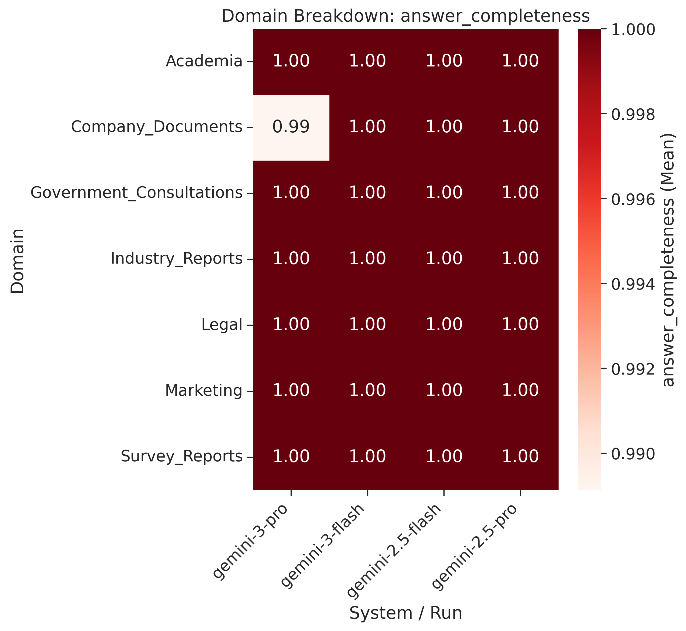
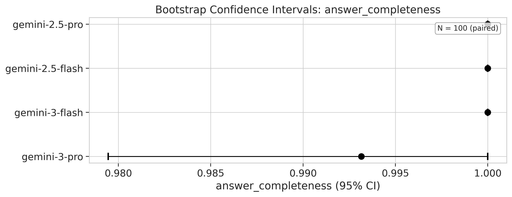
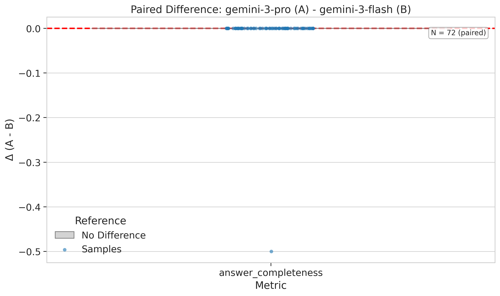
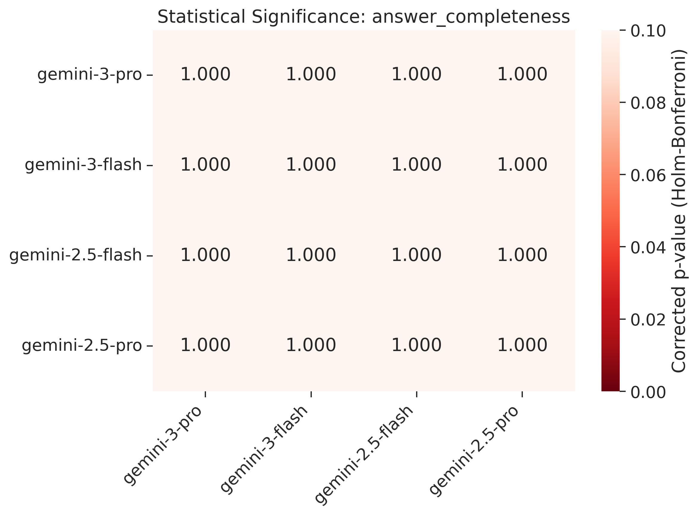
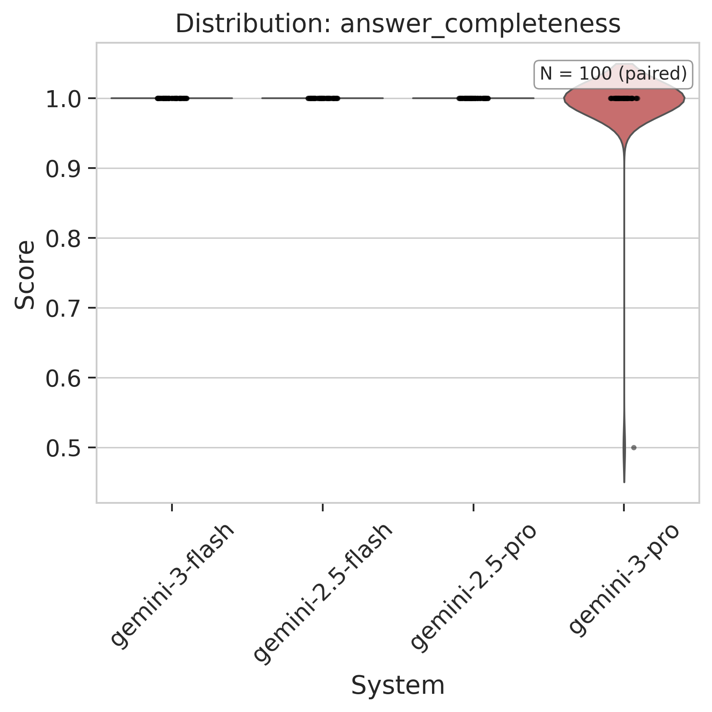
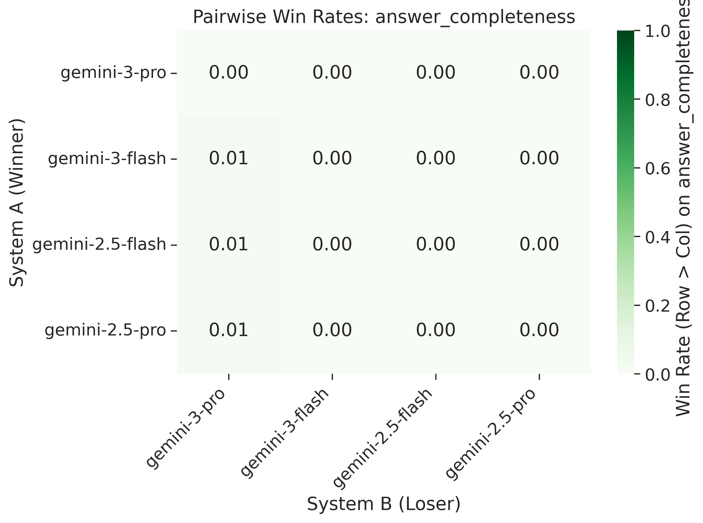

### Visualization Interpretation

#### **1. PhD-Level Interpretation of Trends**

The provided visualizations collectively indicate a strong **ceiling effect** for the `answer_completeness` metric across all evaluated systems (`gemini-3-pro`, `gemini-3-flash`, `gemini-2.5-flash`, `gemini-2.5-pro`). The models consistently achieve near-perfect or perfect scores, suggesting the task, as measured by this metric, may not be sufficiently challenging to differentiate the capabilities of these advanced systems.

The most salient finding is a subtle but critical distinction in the performance profile of `gemini-3-pro`. While three of the four models (`gemini-3-flash`, `gemini-2.5-flash`, `gemini-2.5-pro`) exhibit perfect scores (1.00) with no variance, `gemini-3-pro` displays a slightly lower mean score and, more importantly, a non-zero variance. The **Distribution** and **Paired Difference** plots are crucial here. They reveal that `gemini-3-pro`'s performance is not uniformly weaker; rather, it is characterized by a rare but significant failure mode. The distribution violin plot shows a density heavily concentrated at 1.0 but with a long tail, including a distinct outlier at a score of 0.5. The paired difference chart versus `gemini-3-flash` confirms this, showing the vast majority of samples have a zero difference, but at least one instance exists where `gemini-3-pro`'s score is 0.5 lower. This indicates that while almost always perfect, `gemini-3-pro` is susceptible to occasional, catastrophic failures in answer completeness that are not observed in the other models.

Despite this observed difference in performance distribution, the **Statistical Significance** heatmap, with all corrected p-values at 1.000, indicates no statistically significant difference between any pair of models. This is a classic consequence of a ceiling effect: when failures are extremely rare, they do not provide enough statistical power to declare one system superior to another, even if a qualitative difference in error profile exists.

#### **2. Key Takeaways**

*   **Metric Saturation:** The `answer_completeness` metric is saturated by all tested models. Their performance is at or near the maximum possible score, limiting the metric's utility for fine-grained differentiation.
*   **Robustness Across Models:** All systems demonstrate an exceptional ability to generate complete answers that address all components of the user's query.
*   **Anomalous Failure Mode in `gemini-3-pro`:** Unlike the other models which scored perfectly on every instance, `gemini-3-pro` exhibits a rare but severe failure mode, occasionally producing a significantly incomplete answer. This is evidenced by the outlier in its score distribution and the 1% win rate of other models against it.
*   **No Statistical Differentiation:** The rarity of errors means that despite the observed performance anomaly in `gemini-3-pro`, the differences are not statistically significant after applying a Holm-Bonferroni correction.

#### **3. Contrasting Global vs. Domain-Specific Views**

The comparison between the global confidence intervals and the domain-specific breakdown provides insight into the consistency of model performance.

*   The **Bootstrap Confidence Intervals** plot offers a global summary, immediately highlighting `gemini-3-pro`'s slight performance dip and higher variance compared to the flawless records of the other three models.
*   The **Domain Breakdown** heatmap complements this by showing that this high performance is remarkably consistent across diverse and specialized domains, including `Academia`, `Legal`, and `Industry_Reports`. The ceiling effect holds true regardless of the topical context.
*   Crucially, the heatmap localizes the source of `gemini-3-pro`'s minor global dip. The only cell with a value below 1.00 is `gemini-3-pro` in the `Company_Documents` domain (mean score of 0.99). This suggests that the rare failures observed for `gemini-3-pro` may be concentrated within this specific domain. The overall takeaway is that performance is overwhelmingly stable and not sensitive to domain, with one minor, localized exception for a single model.

#### **4. Interpretation of the `answer_completeness` Metric**

The `answer_completeness` metric assesses the semantic capability of a model to fully address all explicit and implicit parts of a prompt. It is a measure of content coverage rather than rigid lexical overlap (like ROUGE) or strict factual correctness.

*   **High Semantic Competence:** The near-perfect scores across the board imply that all evaluated models have mastered the ability to deconstruct complex queries and ensure all sub-tasks or questions are answered. This points to a high level of semantic understanding and instruction-following.
*   **Nature of Failure:** The rare failure of `gemini-3-pro` (e.g., scoring 0.5) is therefore not a minor stylistic deviation but a significant semantic error. It signifies a complete failure to address a substantial part of the user's request. This type of error can be more detrimental to user trust than a small factual inaccuracy, as it suggests the model misunderstood or ignored a core part of the directive. Contrasted with a strict correctness metric, a model could be 100% complete but factually wrong. Here, the focus is purely on the structural and semantic integrity of the response relative to the prompt.

---

## Analysis of Metric: `answer_length`

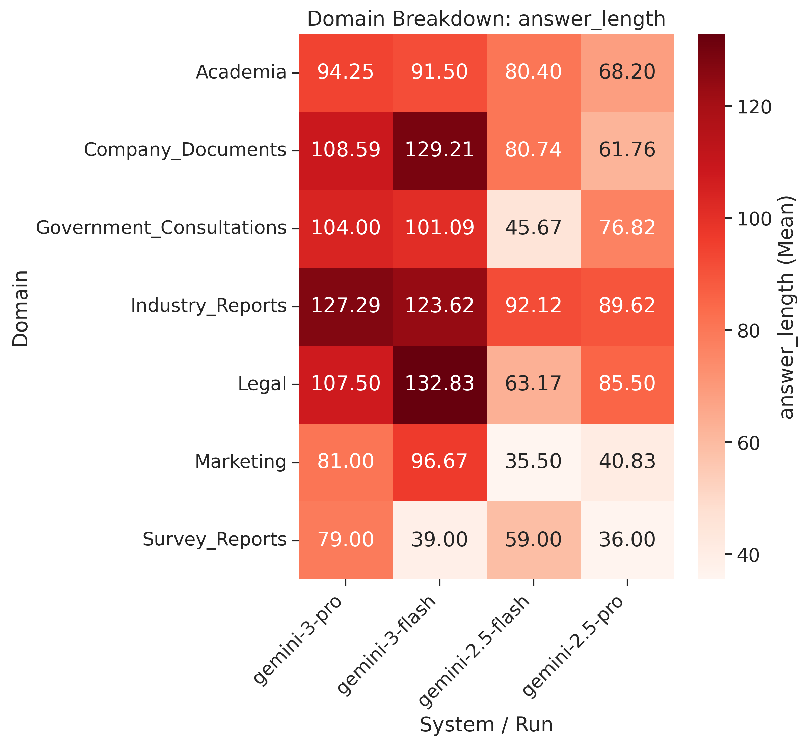
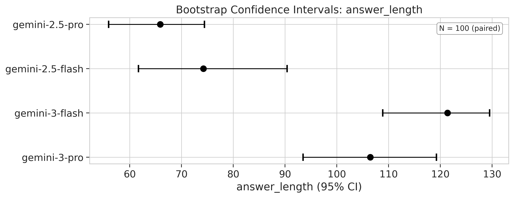
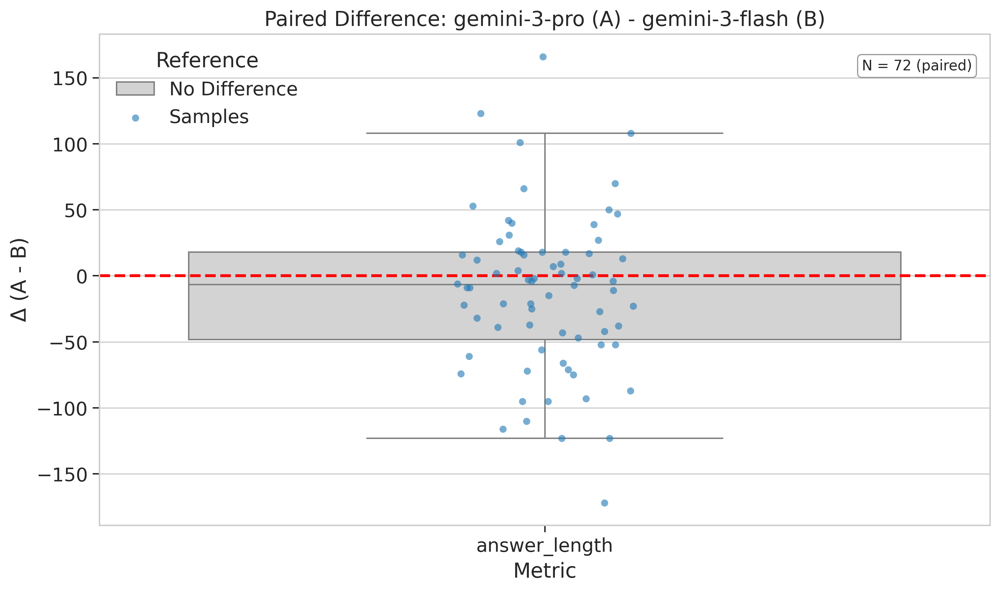

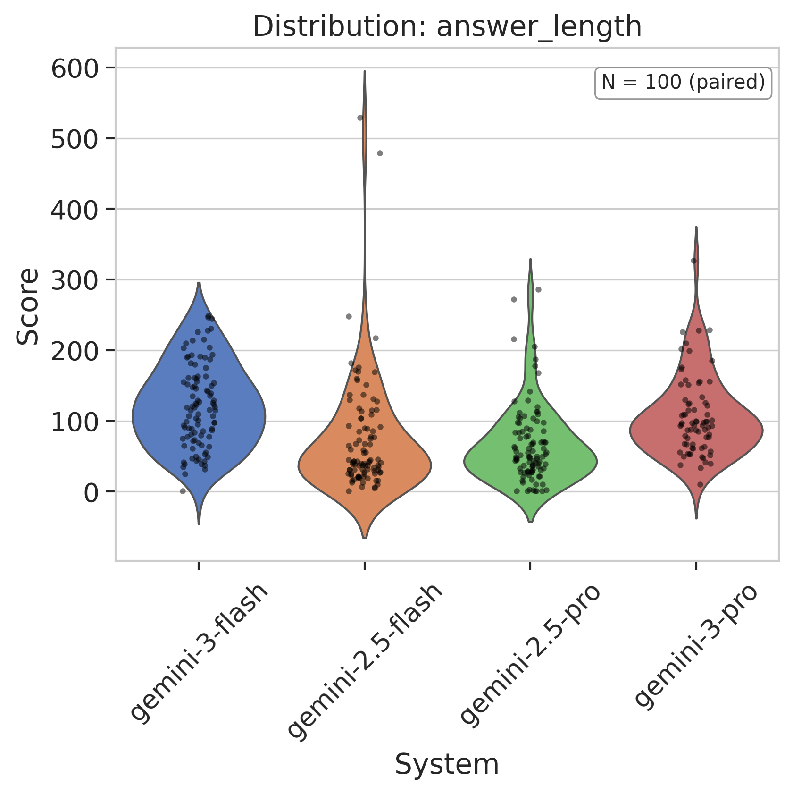
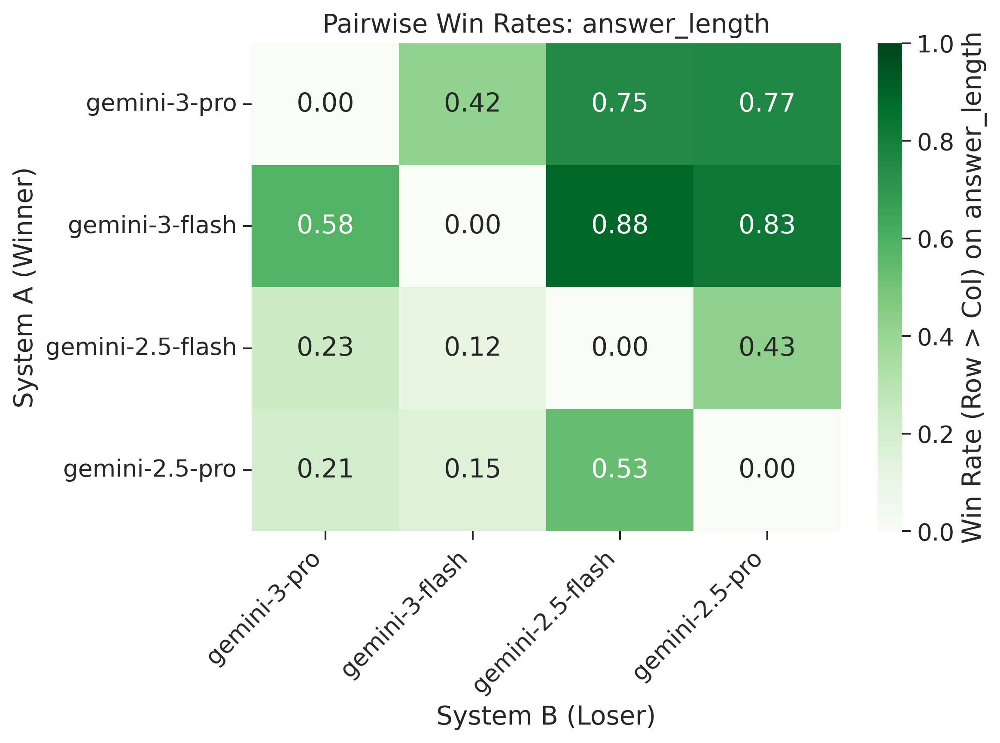

### Visualization Interpretation

This subsection provides a detailed analysis of the `answer_length` metric, a measure of model verbosity, based on the provided visualizations from the GLASS evaluation harness.

The visualizations collectively reveal a distinct behavioral separation between the two model families under evaluation. The most salient finding, clearly illustrated by the Bootstrap Confidence Intervals and Distribution plots, is that the Gemini 3-series models (`gemini-3-pro`, `gemini-3-flash`) are significantly more verbose than their 2.5-series counterparts (`gemini-2.5-flash`, `gemini-2.5-pro`). The confidence intervals for the two families are non-overlapping, and the Statistical Significance heatmap confirms this with corrected p-values of 0.000 for all cross-family comparisons, indicating a highly significant difference in mean answer length.

Delving into intra-family comparisons reveals more nuanced behaviors. While the global confidence intervals suggest `gemini-3-flash` is, on average, longer than `gemini-3-pro`, the statistical significance test shows this difference is not significant (p=0.123). The Pairwise Win Rate plot clarifies this tension, showing that `gemini-3-flash` produces a longer answer in 58% of cases—a tendency, but not a dominant one. The Paired Difference plot for these two models further highlights this variability, with a median difference below zero but a wide distribution of individual sample differences. In contrast, `gemini-2.5-flash` and `gemini-2.5-pro` are statistically indistinguishable in their verbosity (p=0.832), a finding supported by their nearly identical win rates (53% vs. 47%).

Contrasting the aggregate statistics with the domain-specific breakdown is critical. The Domain Breakdown heatmap shows that global averages can mask significant performance variations across different topics. For instance, while `gemini-3-pro` and `gemini-3-flash` appear similar on average, `gemini-3-flash` is substantially more verbose in domains like `Company_Documents` and `Legal`, whereas `gemini-3-pro` is markedly longer in `Survey_Reports`. This demonstrates that model verbosity is not a static characteristic but is highly sensitive to the input domain. All models tend to produce longer, more detailed responses for complex domains like `Industry_Reports` and `Legal`, and are more concise for `Marketing` and `Survey_Reports`.

It is crucial to interpret `answer_length` as a behavioral metric, not an intrinsic measure of quality. Unlike semantic metrics such as `bert_score_f1` or `rouge_score`, which assess lexical or semantic overlap with a reference, `answer_length` simply quantifies output verbosity. Increased length could correlate positively with thoroughness and detail, but it could also indicate a propensity for unnecessary elaboration or a failure to be concise. The violin plot, showing long right-tails for all models, particularly `gemini-3-flash`, suggests that all systems are prone to generating occasional extremely long responses. To draw conclusions about quality, this analysis of verbosity must be contextualized with correctness or helpfulness metrics. For example, if the increased verbosity of the Gemini 3-series corresponds to higher scores on a factuality metric, it indicates valuable, detailed responses; if not, it may point to a need for improved instruction following for conciseness.

---

## Analysis of Metric: `bert_score_f1`

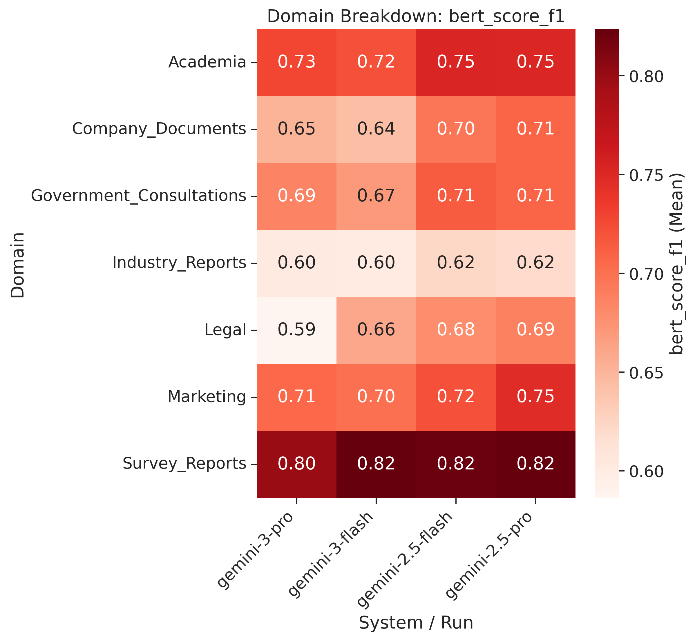
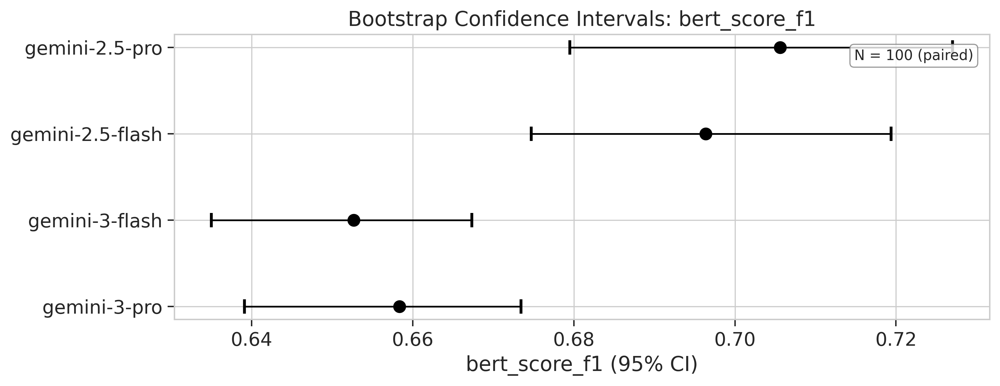
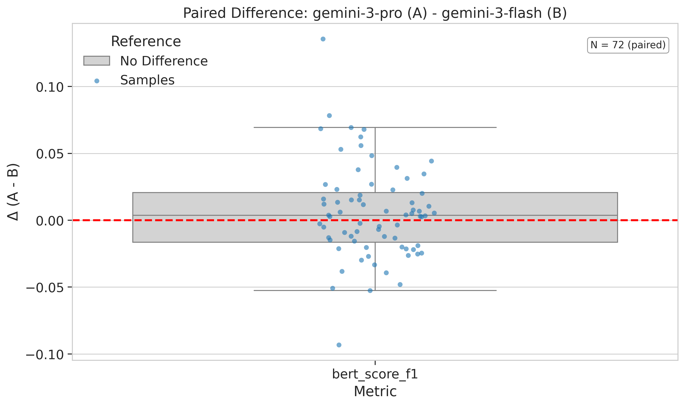

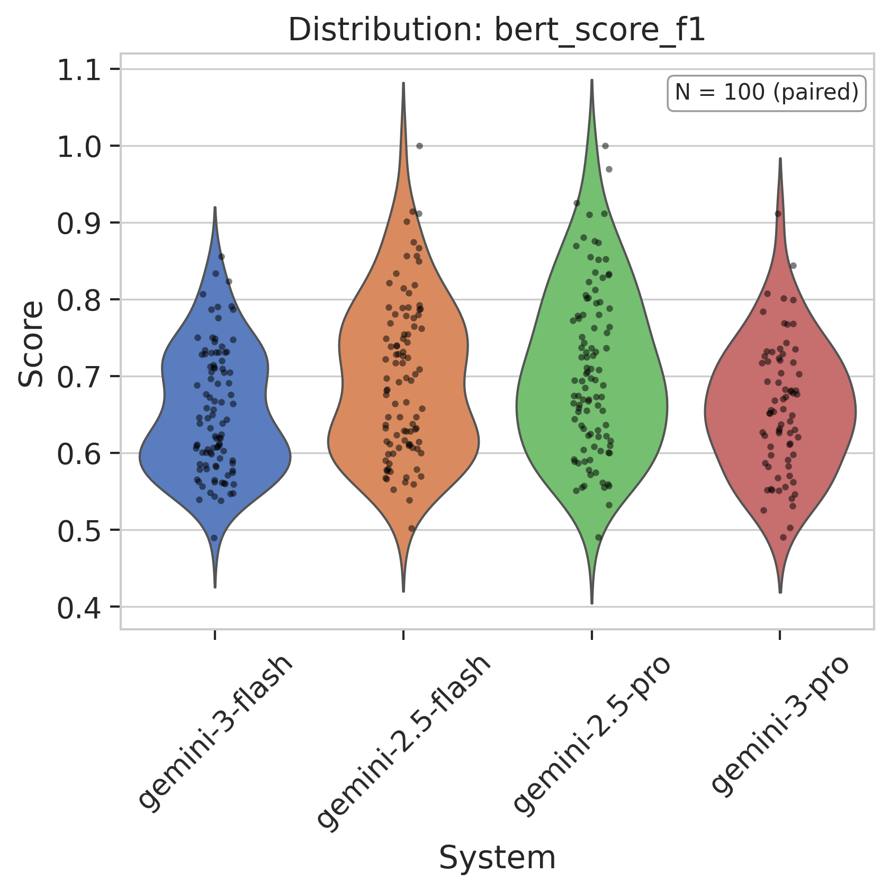
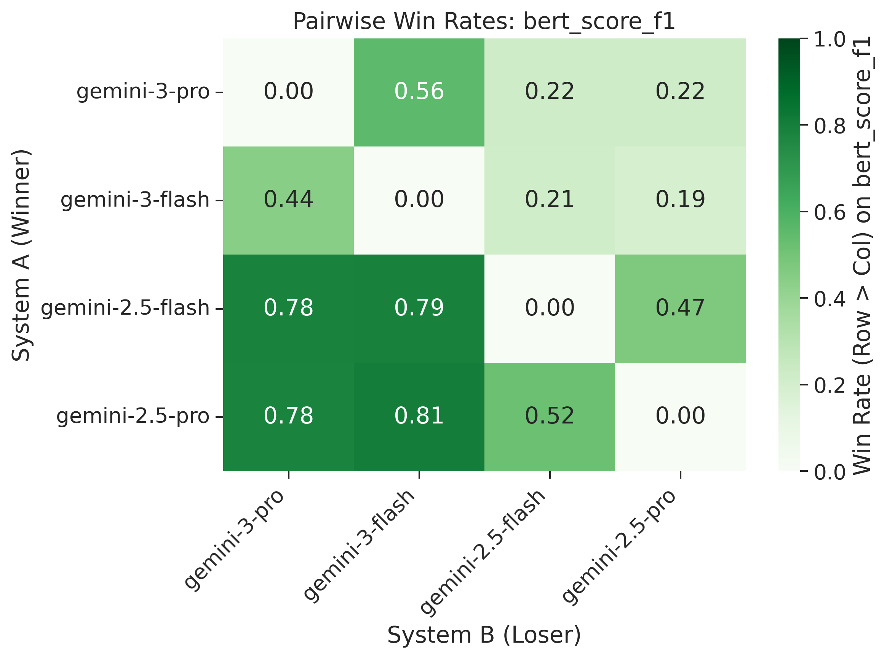

### Visualization Interpretation

This subsection provides a comprehensive analysis of the model performance on the `bert_score_f1` metric, drawing insights from multiple visualizations including aggregate statistics, domain-specific breakdowns, and pairwise statistical comparisons.

#### 1. PhD-Level Interpretation of Trends

The collective evidence from the visualizations points to a clear and statistically significant performance hierarchy among the evaluated systems. The Gemini 2.5 series (`gemini-2.5-pro` and `gemini-2.5-flash`) robustly outperforms the Gemini 3 series (`gemini-3-pro` and `gemini-3-flash`) in generating text that is semantically similar to the reference standard, as measured by `bert_score_f1`.

The Bootstrap Confidence Intervals (CI) plot provides the initial aggregate view, showing a distinct separation between the two model families. The CIs for the Gemini 2.5 models (centered around 0.70-0.71) do not overlap with the CIs for the Gemini 3 models (centered around 0.65-0.66), suggesting a significant performance gap. This observation is rigorously confirmed by the Statistical Significance heatmap, which reports Holm-Bonferroni corrected p-values of 0.000 for all cross-family comparisons (e.g., `gemini-2.5-pro` vs. `gemini-3-pro`). This indicates that the observed superiority of the Gemini 2.5 series is highly unlikely to be due to random chance.

Conversely, within each model generation, the differences are negligible. The CIs for `gemini-2.5-pro` and `gemini-2.5-flash` overlap substantially, as do those for `gemini-3-pro` and `gemini-3-flash`. The significance heatmap corroborates this with a high p-value of 0.703 for both intra-family comparisons. The "Paired Difference" plot for `gemini-3-pro` vs. `gemini-3-flash` further illustrates this parity, with the distribution of score differences centered squarely on zero. Finally, the Pairwise Win Rates heatmap quantifies this trend from an instance-level perspective: the Gemini 2.5 models achieve a higher score than their Gemini 3 counterparts on approximately 78-81% of the test cases, while intra-family win rates hover near 50%, indicating a toss-up.

#### 2. Key Takeaways

*   **Clear Performance Tiers:** There are two distinct performance tiers. Tier 1 consists of `gemini-2.5-pro` and `gemini-2.5-flash`, which perform best. Tier 2 consists of `gemini-3-pro` and `gemini-3-flash`. The performance gap between these tiers is statistically significant.
*   **No "Pro" vs. "Flash" Advantage:** Within both the Gemini 2.5 and Gemini 3 families, the "pro" and "flash" variants are statistically indistinguishable in terms of their `bert_score_f1` performance. This suggests that for this semantic similarity task, the optimizations in the "flash" models do not come at a cost to output quality, nor do the "pro" models offer a discernible benefit.
*   **High Domain Sensitivity:** Model performance is not uniform across all document types. All models excel on `Survey_Reports` (scores > 0.80) and struggle most with `Legal` documents (scores as low as 0.59). This highlights the importance of domain-specific evaluation, as global average scores can mask critical weaknesses.
*   **Semantic Fidelity of Gemini 2.5:** The superior `bert_score_f1` of the Gemini 2.5 series indicates a stronger capability for generating summaries that capture the semantic essence and meaning of the reference text, compared to the Gemini 3 models in this evaluation.

#### 3. Global vs. Domain-Specific Performance

Contrasting the global confidence intervals with the domain-specific heatmap reveals critical nuances. The CI plot presents a clear, unambiguous global ranking: {`gemini-2.5-pro`, `gemini-2.5-flash`} > {`gemini-3-pro`, `gemini-3-flash`}. The domain breakdown confirms that this general trend holds across most individual domains.

However, the domain view also demonstrates that performance is not monolithic. In the `Survey_Reports` domain, all models perform exceptionally well, and the gap between the best (`gemini-2.5-pro` at 0.82) and worst (`gemini-3-pro` at 0.80) is minimal. This suggests the task in this domain may be simpler or more formulaic. Conversely, in the `Legal` domain, not only is performance universally lower, but the performance gap also widens considerably (`gemini-2.5-pro` at 0.69 vs. `gemini-3-pro` at 0.59). This indicates that the semantic challenges posed by complex legal language amplify the performance differences between the model families. The global CI, while correctly identifying the overall winner, obscures the fact that the models' robustness varies significantly when faced with different topical challenges.

#### 4. Interpreting `bert_score_f1` and Semantic Capability

`bert_score_f1` is a metric that evaluates the semantic similarity between a generated text and a reference text by comparing their contextual token embeddings. Unlike lexical overlap metrics like ROUGE, which reward exact word matches, BERTScore rewards the use of synonyms and paraphrases that preserve the original meaning.

A high `bert_score_f1`, as seen for all models on `Survey_Reports`, implies that the generated summaries are semantically very close to the gold-standard summaries. The models are successfully identifying and re-stating the key information in a way that aligns with the reference's meaning. The consistent lead of the Gemini 2.5 models suggests a superior ability to paraphrase and maintain semantic fidelity across various contexts.

This should be contrasted with hypothetical strict correctness metrics, such as named-entity recall or numerical accuracy. A model could achieve a high BERTScore by generating a semantically plausible but factually incorrect statement (e.g., "sales increased significantly" vs. "sales increased by 20%"). The low scores in the `Legal` domain might indicate a failure to capture the precise, nuanced meaning required by legal text, even if the generated text is topically relevant. While BERTScore is a powerful proxy for semantic quality, it does not guarantee factual or rigid format adherence. A complete evaluation would complement this analysis with stricter, fact-based metrics to ensure that the models' semantic fluency is grounded in accuracy.

---

## Analysis of Metric: `citation_presence`

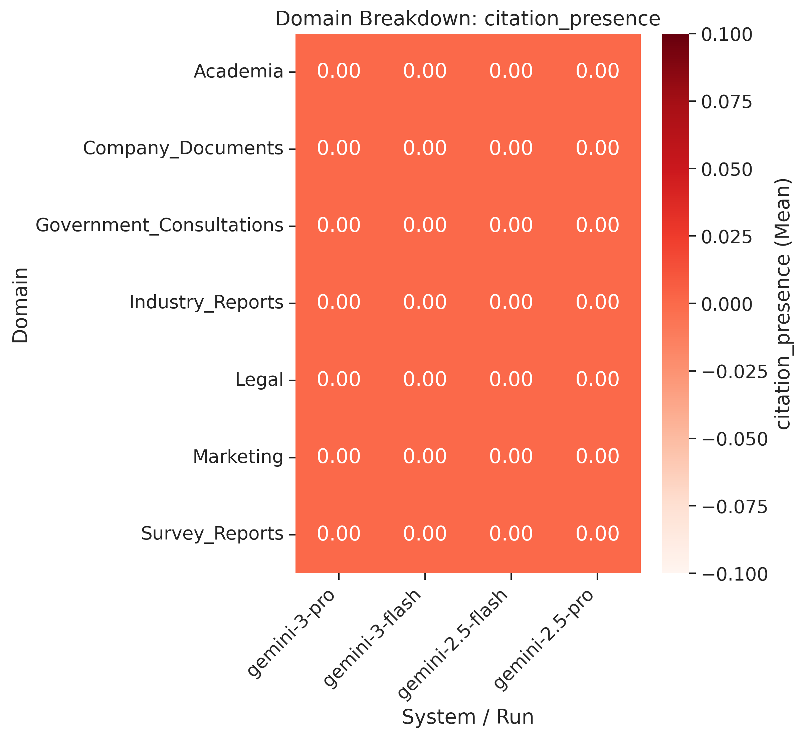
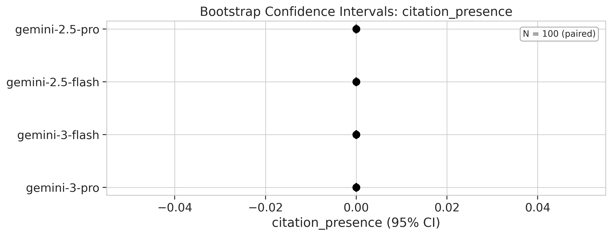

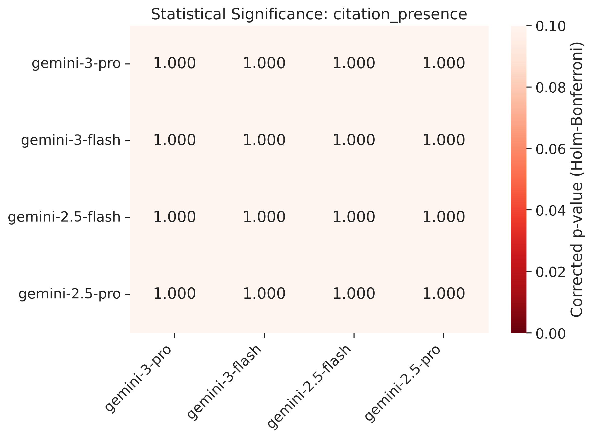
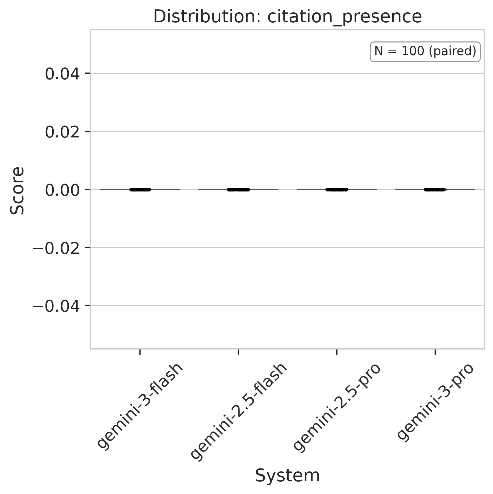
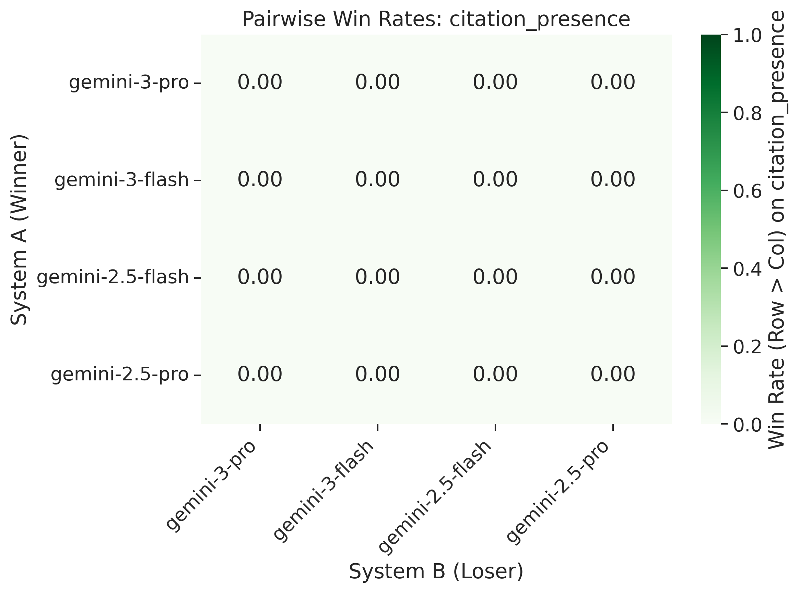

### Visualization Interpretation

**High-Level Summary:**
The provided visualizations offer a comprehensive and statistically robust analysis of the `citation_presence` metric across four models: `gemini-3-pro`, `gemini-3-flash`, `gemini-2.5-flash`, and `gemini-2.5-pro`. The results are strikingly clear and consistent across all plots: every model scored exactly 0.00 on this metric for every single data point, resulting in zero variance both within and between models. This indicates a systematic behavior rather than a nuanced difference in capability. The core ambiguity lies in whether a score of 0.00 represents perfect adherence to a "no citations required" format or a complete and universal failure to generate required citations.

**Detailed Analysis:**

1.  **Invariant Performance and Statistical Indistinguishability:**
    The most salient observation is the complete lack of any performance variation. The "Distribution" box plot and "Bootstrap Confidence Intervals" chart are particularly revealing, showing that for all models, the entire distribution of scores is concentrated at a single point: 0.00. The 95% confidence intervals have zero width, indicating that the mean score in every bootstrap resample was precisely 0. This implies that not a single test instance yielded a non-zero score for any model.

    Consequently, all pairwise comparisons confirm that the models are statistically indistinguishable on this metric. The "Statistical Significance" heatmap shows corrected p-values of 1.000 for all model pairs, signifying no detectable difference. The "Pairwise Win Rates" heatmap corroborates this, with all win rates at 0.00, meaning no model ever outperformed another. The "Paired Difference" plot further visualizes this, with all individual sample differences (Δ) falling exactly on the "No Difference" line.

2.  **Consistency Across Topical Domains:**
    The "Domain Breakdown" heatmap is critical as it preempts any hypothesis that the global zero-score is an artifact of averaging heterogeneous performance. The analysis shows that the mean score is 0.00 not just globally, but within every specific domain tested, from `Academia` to `Survey_Reports`. This demonstrates that the observed behavior is not sensitive to the topic of the document; all models exhibit the same performance characteristic regardless of the domain context.

3.  **Interpretation of `citation_presence` as a Metric:**
    `citation_presence` is a format-based, structural correctness metric, not a semantic one like `bert_score` or `rouge`. It likely performs a binary check or a count of citation markers (e.g., `[1]`, `(Author, 2023)`) in the generated output. A score of 0.00 has two primary interpretations:
    *   **Perfect Adherence:** If the reference outputs in the test set contain no citations, and the task does not require them, a score of 0.00 indicates that all models correctly and perfectly adhered to this constraint. They successfully avoided generating spurious or hallucinated citations.
    *   **Systematic Failure:** Conversely, if the reference outputs *do* require citations, a score of 0.00 signifies a complete and systematic failure of all four models to generate this specific structural element.

**Key Takeaways:**

*   **No Differentiation Between Models:** The `citation_presence` metric fails to differentiate between any of the evaluated Gemini models. Their performance is identical and invariant.
*   **Systematic Behavior:** The consistent zero-score across all models, domains, and individual examples points to a systematic behavior. This is likely due to either a universal model capability/limitation concerning citation generation for this specific task or a feature of the dataset itself (i.e., a universal absence of required citations).
*   **Task-Metric Alignment is Key:** The ultimate conclusion depends on the ground truth of the evaluation task. If no citations were expected, these results indicate flawless performance in format adherence. If citations were expected, this reveals a critical and shared failure mode across a new generation of models. Without this context, the charts diagnose a phenomenon—perfect behavioral homogeneity—but cannot definitively label it as success or failure.

---

## Analysis of Metric: `confidence_score`

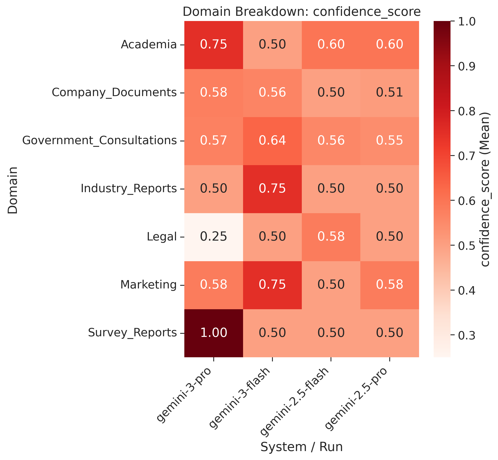
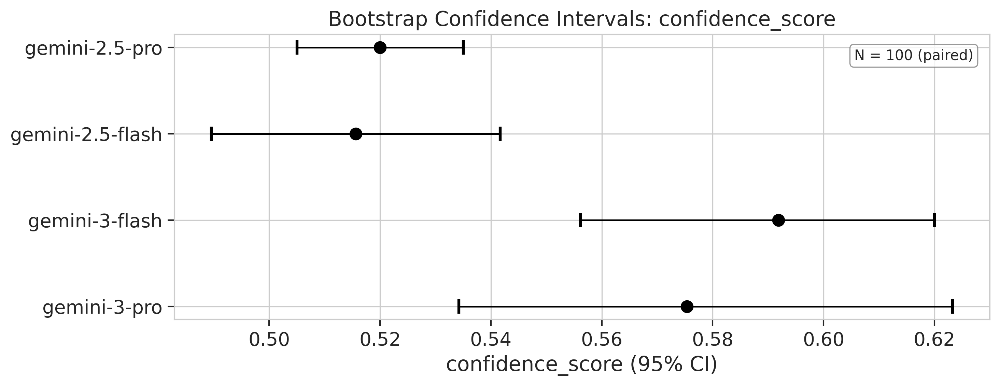
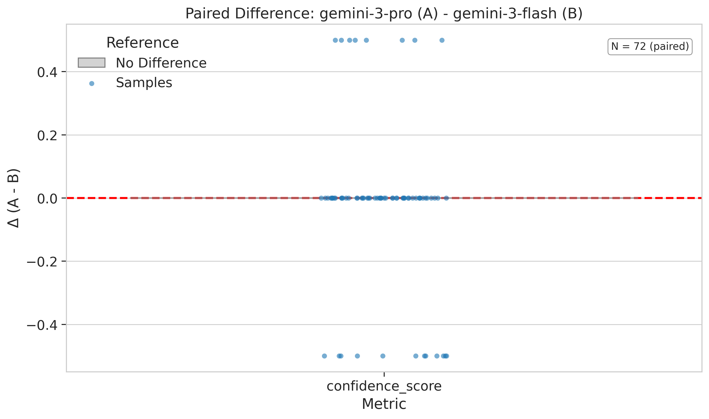
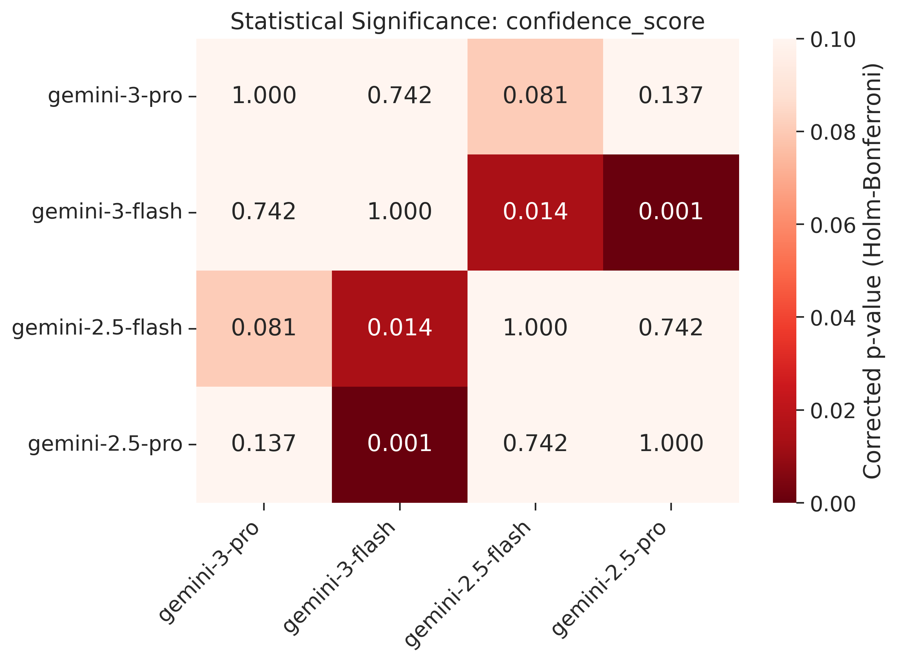
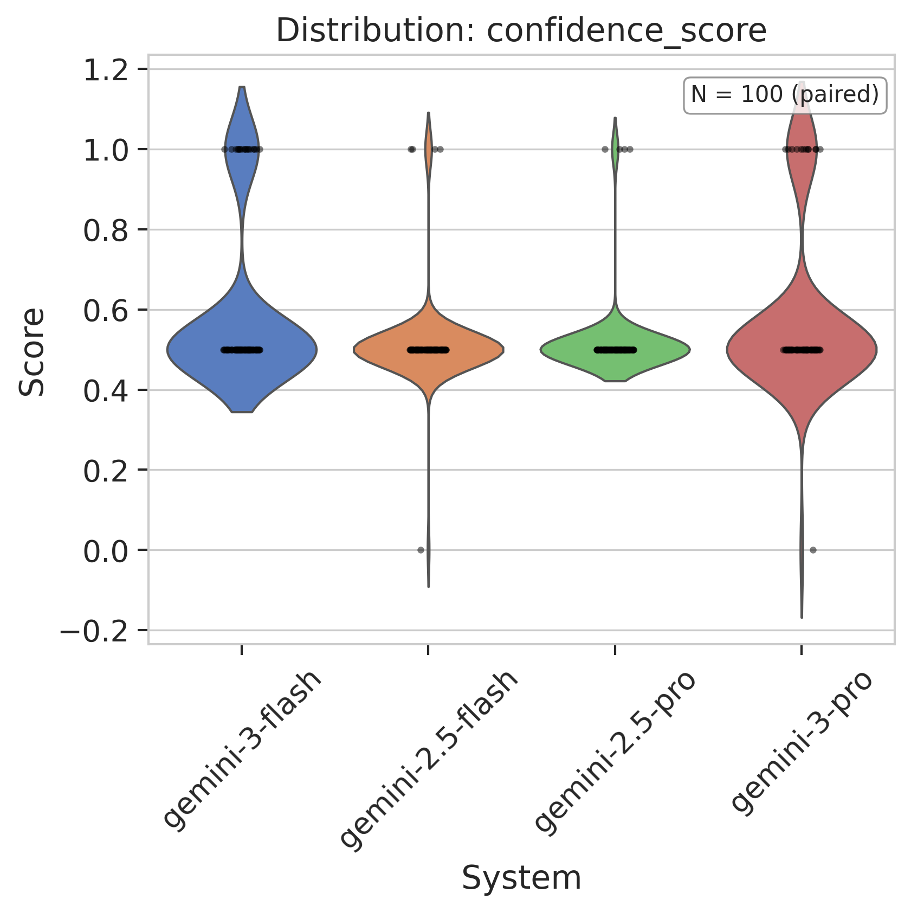
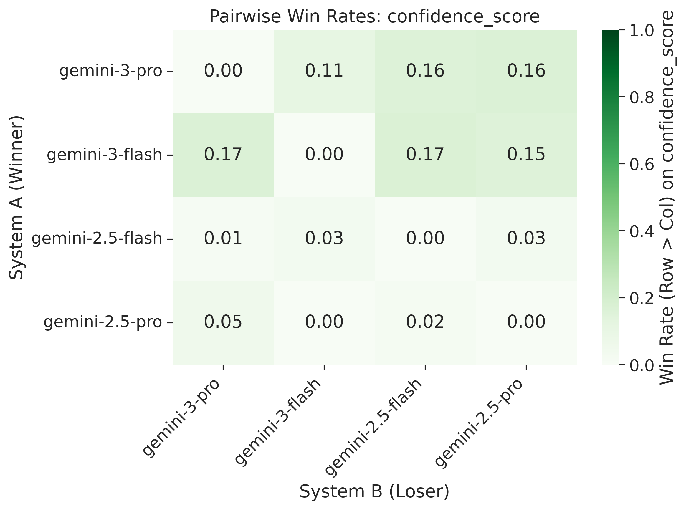

### Visualization Interpretation

This subsection provides a detailed analysis of the model-generated `confidence_score`, a metric presumably evaluating the self-assessed certainty of the language models under review. The analysis synthesizes results from six distinct visualizations to derive insights into overall performance, statistical reliability, and domain-specific behavior.

#### 1. PhD-Level Interpretation of Trends

The suite of visualizations paints a nuanced picture of model performance on the `confidence_score` metric. The central theme is a trade-off between average performance and variance, particularly between the `gemini-3` and `gemini-2.5` series.

Globally, the `gemini-3` models (`pro` and `flash`) exhibit higher mean confidence scores than their `gemini-2.5` predecessors, as evidenced by the Bootstrap Confidence Intervals plot. However, these higher means are accompanied by substantially wider 95% confidence intervals, indicating greater performance variance. The violin plot (Distribution) provides a striking illustration of this phenomenon: `gemini-3-pro` and `gemini-3-flash` display broad, multi-modal distributions with long tails, whereas the `gemini-2.5` models show much tighter, centrally-peaked distributions around a score of 0.5.

This high variance in the `gemini-3` series has direct implications for statistical significance. The p-value heatmap reveals that while `gemini-3-flash` achieves a statistically significant improvement over both `gemini-2.5-flash` (p=0.014) and `gemini-2.5-pro` (p=0.001), the improvement from `gemini-3-pro` is not statistically significant (p > 0.05). This is a classic example of how high variance can obscure a difference in means. The paired difference plot between `gemini-3-pro` and `gemini-3-flash` further highlights this instability, showing many instances clustered around zero difference but also several outliers with large positive and negative deltas, confirming that neither model consistently dominates the other on an instance-by-instance basis. The Pairwise Win Rate heatmap consolidates this finding, positioning `gemini-3-flash` as the most consistent winner against all other models.

#### 2. Key Takeaways

1.  **`gemini-3-flash` is the most robust performer:** It demonstrates a statistically significant and consistent improvement in `confidence_score` over the `gemini-2.5` generation, making it the most reliable model for this metric.
2.  **`gemini-3-pro` exhibits a "high-variance" or "spiky" profile:** It achieves the highest observed score (1.00) in one domain but also the lowest (0.25) in another. This erratic behavior leads to a wide performance distribution, and its average improvement over older models is not statistically significant.
3.  **Performance is highly domain-sensitive:** The domain breakdown heatmap is critical, revealing that aggregate scores mask significant underlying performance differences. For example, `gemini-3-pro` excels in `Survey_Reports` and `Academia` but fails dramatically in `Legal` documents.
4.  **Confidence is not necessarily calibrated:** The `gemini-3` models are generally more "confident," but without a corresponding correctness metric, it is impossible to know if this confidence is well-calibrated. High confidence on incorrect outputs is a significant failure mode.

#### 3. Contrasting Global and Domain-Specific Views

Contrasting the global confidence intervals with the domain-specific breakdown reveals that the aggregate metrics are misleading. The wide confidence interval for `gemini-3-pro` (approx. 0.53 to 0.62) is a direct result of its extreme performance across domains. Its mean score of ~0.58 is an average of exceptional scores (e.g., 1.00 in `Survey_Reports`, 0.75 in `Academia`) and very poor scores (0.25 in `Legal`).

In contrast, `gemini-2.5-pro` and `gemini-2.5-flash` show much tighter confidence intervals, which aligns with their relatively flat performance profile in the domain heatmap, where most scores hover between 0.50 and 0.60. This suggests that while the older models are less confident on average, their behavior is far more predictable across different topics. This analysis underscores the importance of domain-stratified evaluation; a practitioner choosing a model for a legal application would wrongly select `gemini-3-pro` based on its global average, whereas the domain-specific chart clearly indicates it is the worst choice.

#### 4. Interpreting `confidence_score`

The `confidence_score` metric measures a model's self-reported certainty in its generation, which is distinct from its factual accuracy or semantic quality. It is a measure of the model's internal state or its ability to follow an instruction to express a confidence level.

-   **High `confidence_score`:** Indicates the model believes its output is highly likely to be correct or appropriate.
-   **Low `confidence_score`:** Suggests uncertainty or an inability to fulfill the prompt's constraints.

In this context, the `gemini-3` models appear to have developed a stronger sense of certainty. However, this must be interpreted with caution. Unlike a `bert_score` which measures semantic overlap with a reference, or a correctness metric which measures factual accuracy, a high `confidence_score` provides no guarantee of quality. The most critical question for future work is one of **calibration**: does the model's confidence correlate with its actual correctness? The erratic, domain-sensitive confidence of `gemini-3-pro` suggests it may be poorly calibrated, expressing supreme confidence in some areas and undue uncertainty in others. A model that is confidently wrong is often more dangerous than one that is uncertain. Therefore, these results highlight the urgent need to evaluate model confidence against objective correctness metrics.

---

## Analysis of Metric: `error_rate`

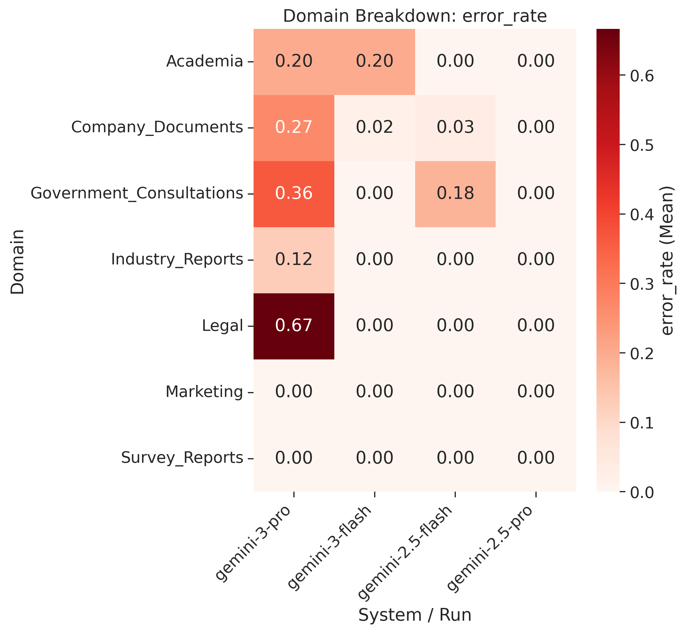
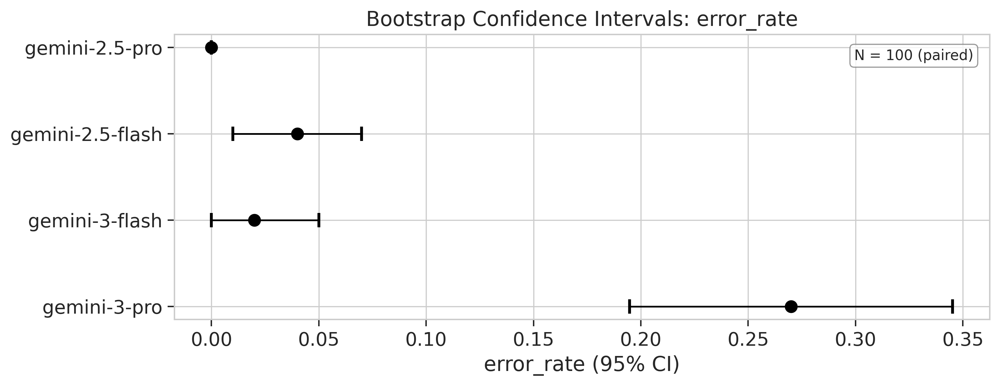
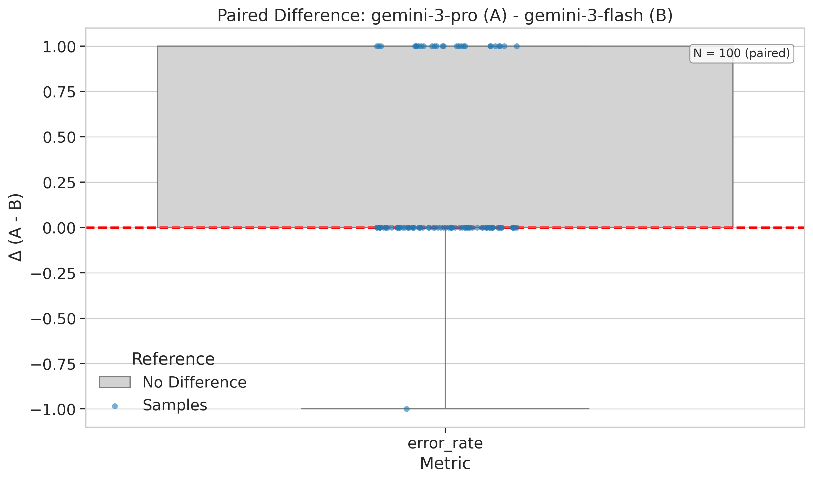
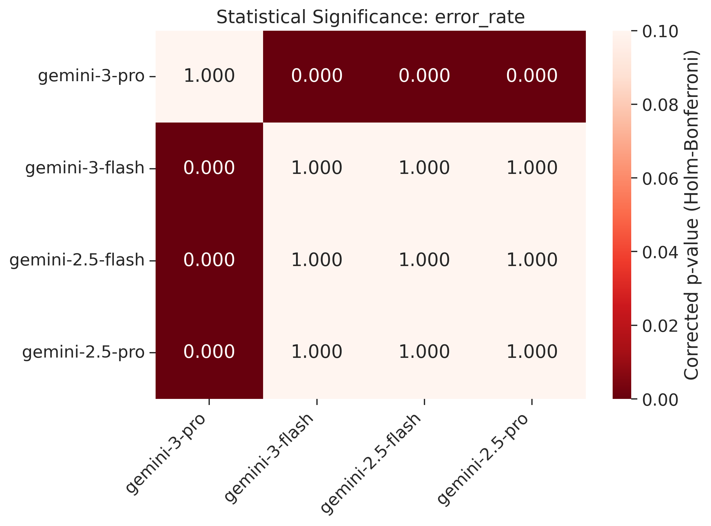
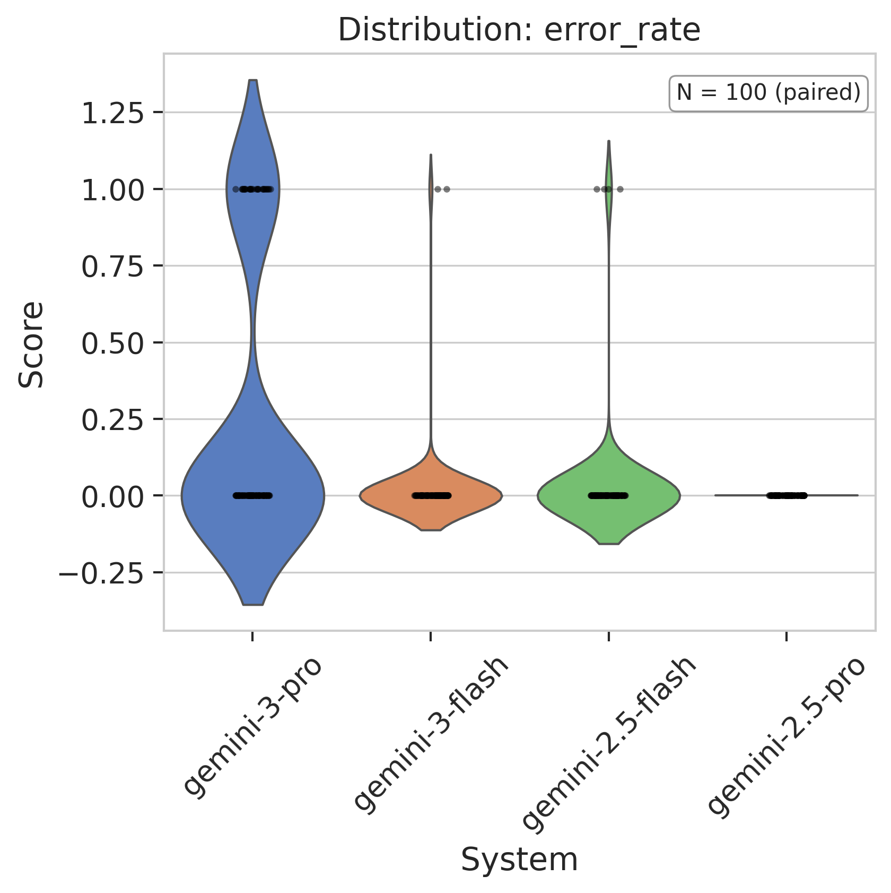
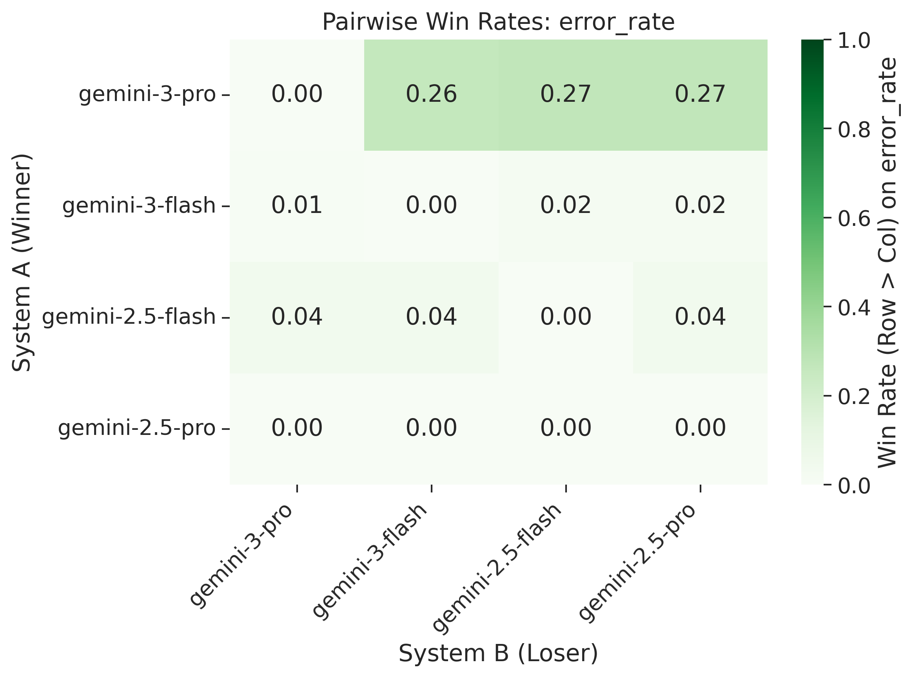

### Visualization Interpretation

This subsection provides a detailed analysis of the `error_rate` metric for the evaluated systems: `gemini-3-pro`, `gemini-3-flash`, `gemini-2.5-flash`, and `gemini-2.5-pro`. The analysis synthesizes insights from multiple perspectives, including aggregate performance with confidence intervals, statistical significance, pairwise comparisons, and domain-specific breakdowns.

#### Key Takeaways

1.  **Clear Performance Hierarchy:** There is a distinct and statistically significant performance hierarchy among the models. `gemini-2.5-pro` is the top-performing system, achieving a perfect score (0% error rate). `gemini-3-flash` and `gemini-2.5-flash` exhibit very low error rates and are statistically indistinguishable from each other. `gemini-3-pro` is a significant outlier, demonstrating a substantially higher error rate than all other models.

2.  **Significant Performance Regression in `gemini-3-pro`:** The `gemini-3-pro` model exhibits a severe performance regression. Its aggregate error rate is approximately 27%, with a wide 95% confidence interval [~0.19, ~0.35], indicating highly inconsistent performance. This poor performance is statistically significant (p < 0.001) against all other tested systems.

3.  **Domain Sensitivity and Catastrophic Failure:** The poor performance of `gemini-3-pro` is not uniformly distributed but is highly sensitive to the topical domain. The domain breakdown heatmap reveals a catastrophic failure rate of 67% in the **Legal** domain, alongside high error rates in **Government_Consultations** (36%) and **Company_Documents** (27%). In contrast, other models, particularly `gemini-2.5-pro`, are robust across all domains.

4.  **Binary Failure Mode:** The distribution plots reveal that `gemini-3-pro`'s errors are not minor. The violin plot for this model is distinctly bimodal, with large probability masses at error scores of 0.0 (perfect success) and 1.0 (complete failure). This indicates that the model tends to either perform the task correctly or fail catastrophically, rather than exhibiting a graceful degradation in performance.

#### Detailed Analysis

The analysis begins with an aggregate view of model performance. The **Bootstrap Confidence Intervals** chart clearly establishes the performance ranking. `gemini-2.5-pro` has an error rate of zero. `gemini-3-flash` and `gemini-2.5-flash` have low, overlapping CIs near zero, suggesting similar capabilities. In stark contrast, `gemini-3-pro`'s confidence interval is high and does not overlap with any other model, immediately highlighting it as the worst performer. The **Statistical Significance** heatmap confirms this visual intuition with quantitative rigor; the performance difference between `gemini-3-pro` and all other models is highly significant (Holm-Bonferroni corrected p-value = 0.000). Conversely, the differences between `gemini-2.5-pro`, `gemini-2.5-flash`, and `gemini-3-flash` are not statistically significant (p = 1.000).

Contrasting this global view with the **Domain Breakdown** provides crucial diagnostic insights. While the aggregate charts show that `gemini-3-pro` is worse, the domain heatmap explains *why* and *where*. Its failures are concentrated in specific, complex domains. The 67% error rate in the "Legal" domain is particularly alarming and suggests a critical vulnerability or brittleness in the model's ability to handle the nuances, terminology, or structural requirements of legal text. This contrasts sharply with `gemini-2.5-pro`'s perfect performance, demonstrating its superior robustness across diverse document types.

The nature of these failures is further illuminated by the **Distribution** and **Paired Difference** plots. The bimodal distribution for `gemini-3-pro` in the violin plot confirms a binary success/failure pattern. The paired difference plot, comparing `gemini-3-pro` (A) against `gemini-3-flash` (B), shows numerous instances where the difference `Δ(A-B)` is 1.0, meaning `gemini-3-pro` failed completely while its `flash` counterpart succeeded. This, combined with the **Pairwise Win Rates** chart showing that `gemini-3-pro` loses to other models on ~27% of instances, solidifies the conclusion that its regression is characterized by an inability to handle a specific subset of challenging tasks, leading to total failure on those inputs.

In summary, while `gemini-2.5-pro` sets a benchmark for reliability with zero errors, the newer `gemini-3-pro` model demonstrates a significant and domain-specific regression. Its high error rate is driven by catastrophic failures in specialized domains like Legal, indicating a critical loss of robustness compared to both its predecessor and its more lightweight contemporaries.

---

## Analysis of Metric: `exact_match`

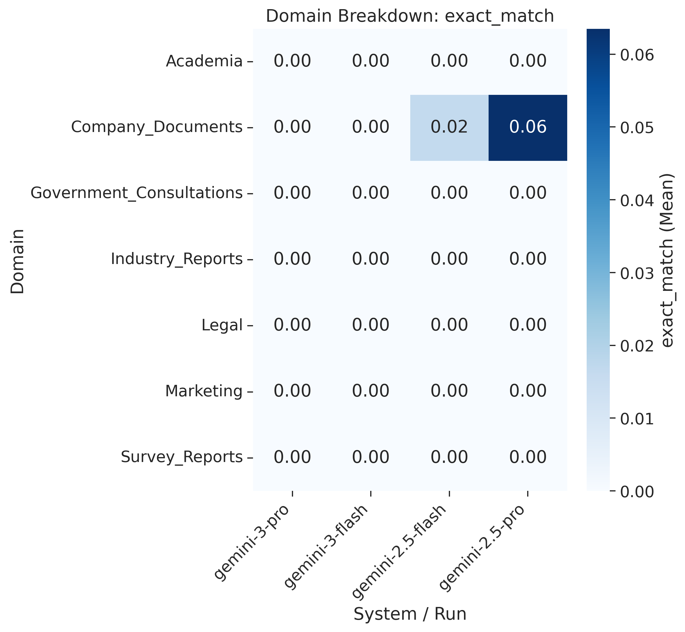
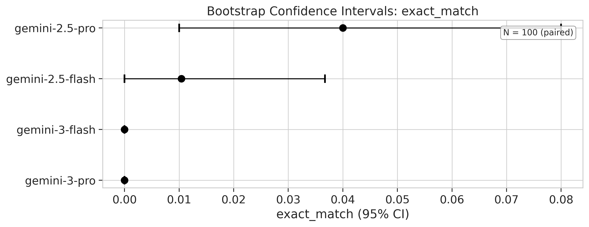

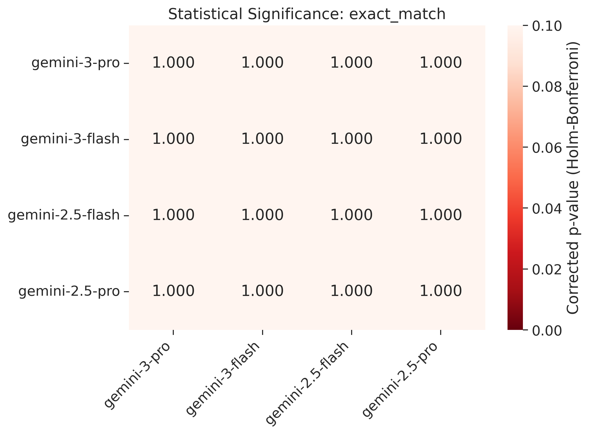
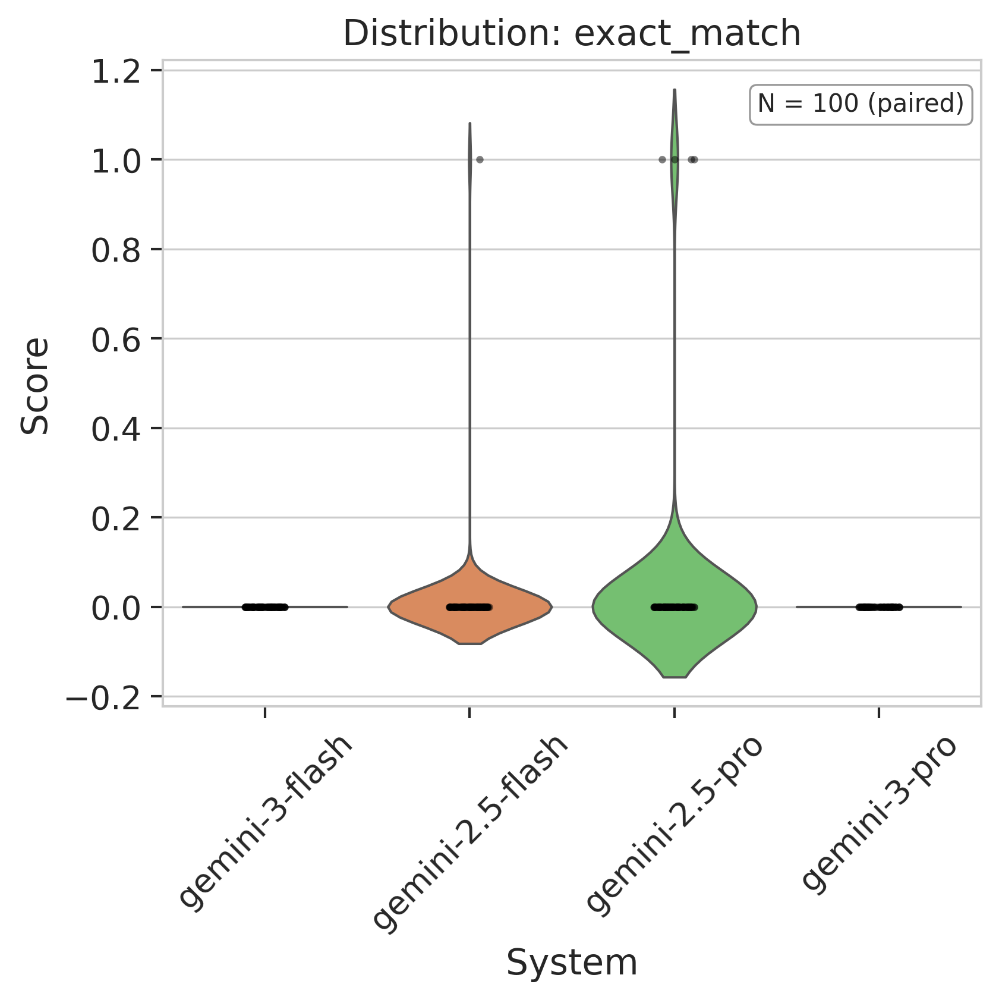
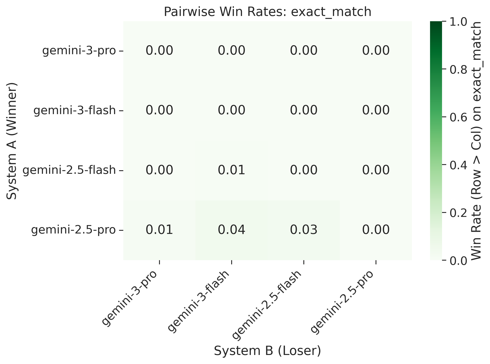

### Visualization Interpretation

This subsection provides a detailed analysis of the model evaluation results for the `exact_match` metric, based on the provided visualizations from the GLASS evaluation harness.

#### 1. PhD-Level Interpretation of Trends

The collective evidence from these visualizations points to a near-total failure of the evaluated systems on the task as measured by the `exact_match` metric. This metric is exceptionally stringent, requiring the model's output to be a character-for-character identical match to the reference solution. A score is binary (1 for a perfect match, 0 otherwise), and the reported values are the mean over the test set.

The overwhelmingly low scores across all models suggest a fundamental misalignment between the models' generative capabilities and the task's requirement for rigid format adherence. The violin plot, in particular, reveals the nature of this failure: the score distribution is not continuous but is instead a point mass at zero for most models, with a very sparse scattering of scores at 1.0 for the `gemini-2.5` series. This indicates that success is a rare, all-or-nothing event rather than a matter of partial correctness.

A clear performance hierarchy emerges: `gemini-2.5-pro` is the best-performing model, followed by `gemini-2.5-flash`. The newer `gemini-3-pro` and `gemini-3-flash` models demonstrate a complete regression on this metric, failing to achieve a single exact match in the entire evaluation set. The paired difference plot between these two Gemini 3 models, showing all differences are exactly zero, confirms they are identically and completely unsuccessful.

Despite the apparent ranking observed in the confidence interval plot (`gemini-2.5-pro`'s mean score is ~0.04, while others are at or near 0), the statistical significance heatmap reports corrected p-values of 1.000 for all pairwise comparisons. This suggests that while there is a difference in the sample mean, the extreme sparsity of "success" events (i.e., scores of 1) and the high variance prevent the differences from reaching statistical significance under the employed permutation tests with Holm-Bonferroni correction. The bootstrap confidence intervals, however, do suggest that `gemini-2.5-pro`'s performance is statistically greater than zero, as its 95% CI does not overlap with 0.

#### 2. Key Takeaways

1.  **Extreme Task Difficulty:** The task is exceptionally challenging when evaluated with `exact_match`. Scores approaching zero indicate that models consistently fail to reproduce the ground truth verbatim.
2.  **Clear Performance Ranking:** A distinct hierarchy is evident: `gemini-2.5-pro` > `gemini-2.5-flash` >> `gemini-3-pro` = `gemini-3-flash`.
3.  **Complete Failure of Gemini 3 Series:** The `gemini-3-pro` and `gemini-3-flash` models score a literal 0.00 on this metric, indicating a significant performance degradation compared to the 2.5 generation on this specific task.
4.  **High Domain Sensitivity:** Model performance is not uniform across topics. The very limited success of the `gemini-2.5` series is entirely concentrated in the `Company_Documents` domain, suggesting this domain may contain simpler or more formulaic target outputs. All models failed completely on all other domains.

#### 3. Contrast Between Global and Domain-Specific Views

Contrasting the global confidence intervals with the domain breakdown provides crucial context. The global view (confidence interval plot) shows that `gemini-2.5-pro` achieves a non-zero, albeit low, average score of approximately 4%. One might initially assume this represents a low but consistent level of performance across the board.

However, the domain breakdown heatmap reveals a starkly different reality. This 4% global average is not the result of widespread, low-frequency success. Instead, it is an artifact of performance being exclusively concentrated in a single domain: `Company_Documents`, where `gemini-2.5-pro` scores 0.06. In every other domain—`Academia`, `Legal`, `Marketing`, etc.—all models, including `gemini-2.5-pro`, score a perfect 0.00. This finding is critical, as it demonstrates that the models' ability to produce exact matches is not a generalizable skill but is highly sensitive and isolated to a specific topical context, which may warrant further investigation into the nature of that domain's data.

#### 4. Interpretation of `exact_match` vs. Semantic Metrics

The `exact_match` metric evaluates rigid format adherence and lexical precision. It does not account for semantic equivalence. A model could produce an answer that is factually correct and conveys the same meaning as the reference but is penalized for trivial differences, such as extra whitespace, a different word choice (e.g., "approximately" vs. "about"), or a missing comma.

The observed scores, being almost universally zero, tell us that the models struggle with this level of formal precision. This does not, however, imply that the models' outputs are semantically incorrect or nonsensical. If this evaluation included metrics like `bert_score_f1` or `rouge_score`, we might see a very different picture. Those metrics measure n-gram overlap (`rouge`) or token-level semantic similarity (`bert_score`) and would award partial credit for answers that are close in meaning.

Therefore, the key limitation of this analysis is that we can only conclude that the models are not good at "mind-reading" the exact expected output format. We cannot conclude anything about their semantic capabilities or factual accuracy on this task. The poor `exact_match` performance could stem from overly verbose outputs, different phrasing, or other stylistic variations that a human evaluator might consider perfectly acceptable.

---

## Analysis of Metric: `latency_s`

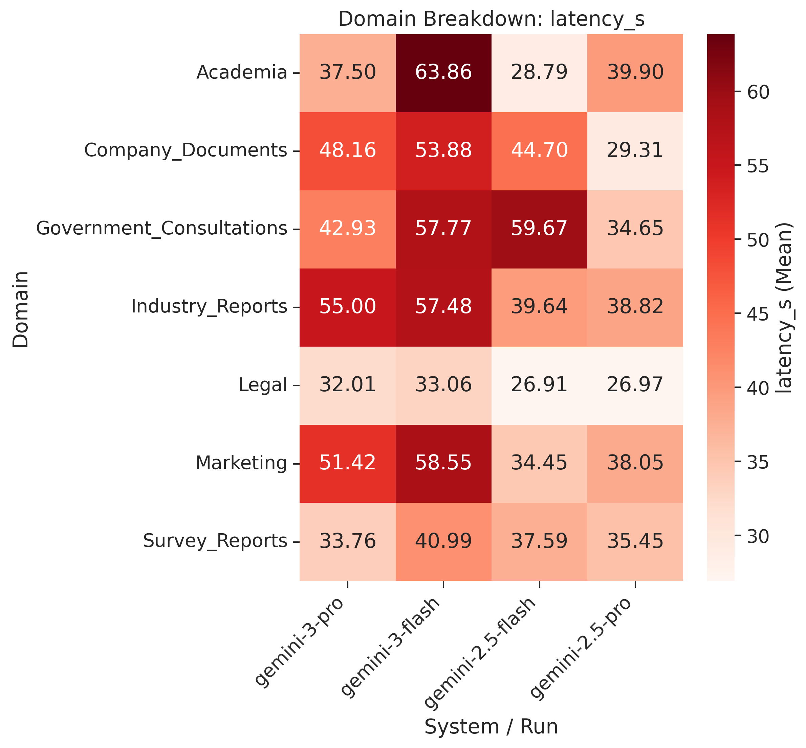
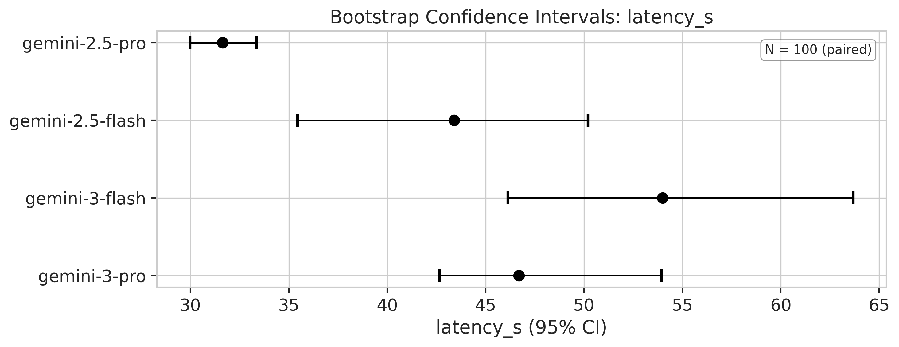
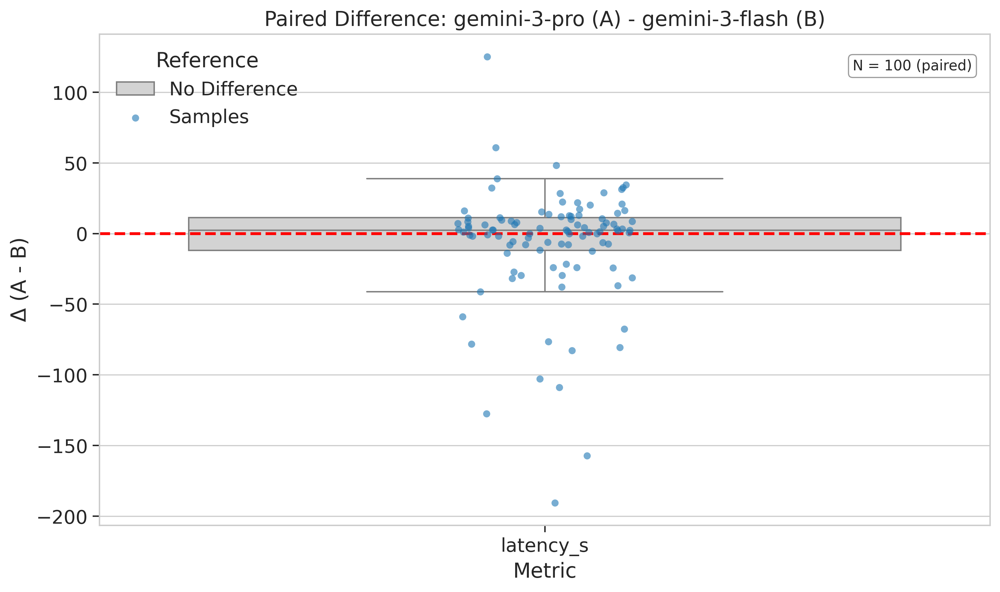
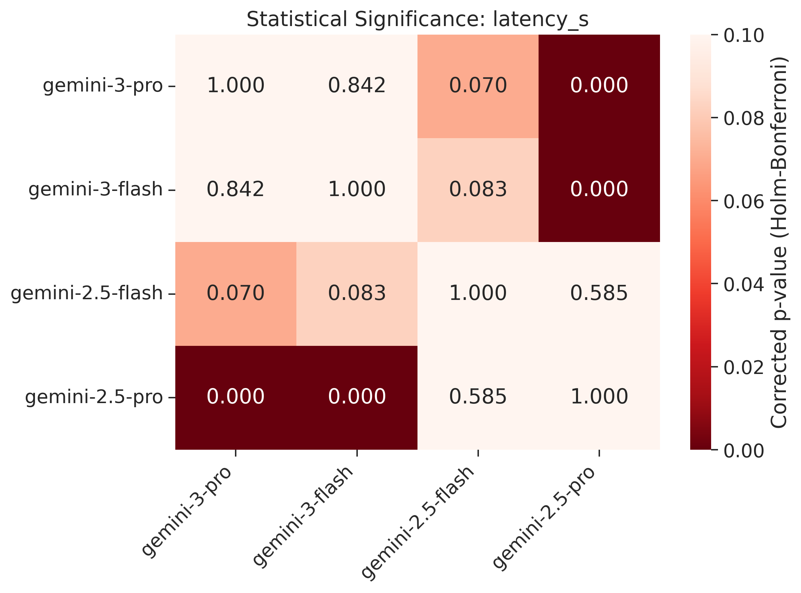
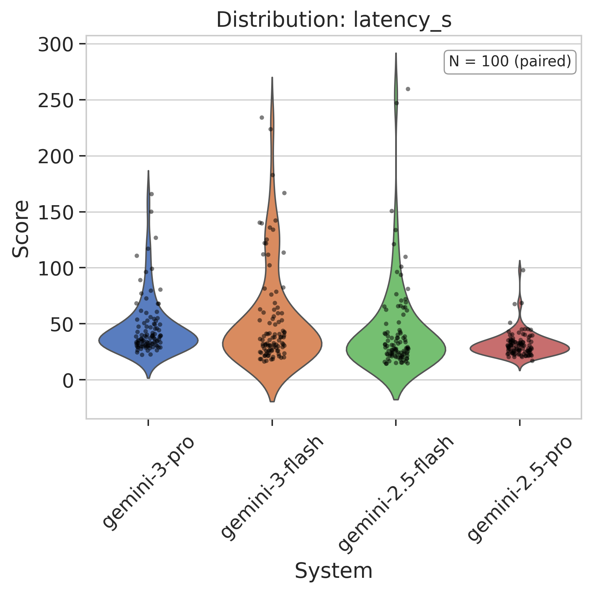
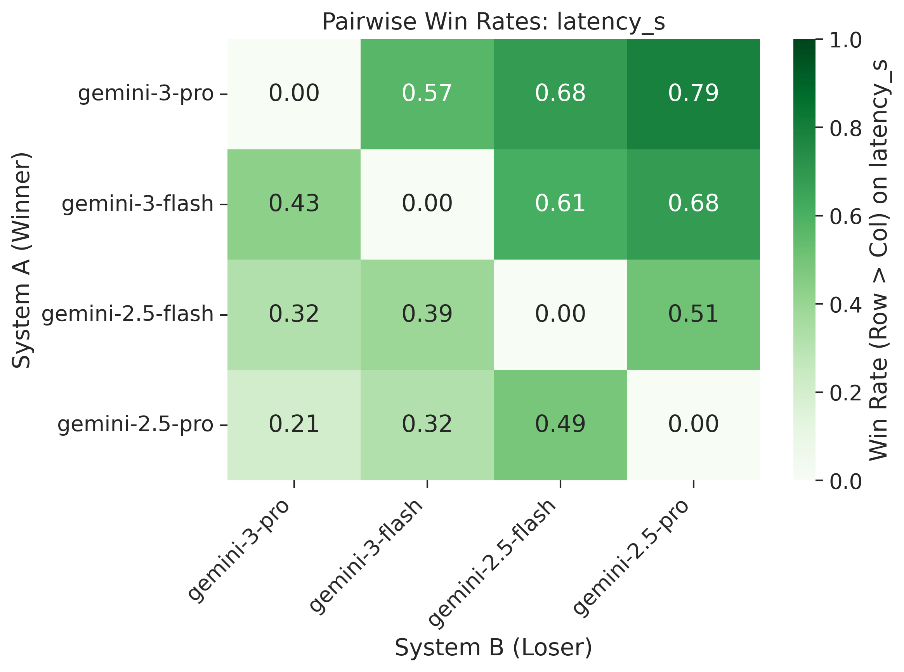

### Visualization Interpretation

This analysis evaluates the operational latency, measured in seconds (`latency_s`), of four generative models: `gemini-3-pro`, `gemini-3-flash`, `gemini-2.5-flash`, and `gemini-2.5-pro`. A lower latency score indicates superior performance, reflecting greater computational efficiency and faster response times. The provided visualizations offer a comprehensive view, from high-level statistical aggregates to granular, domain-specific breakdowns.

#### 1. PhD-Level Interpretation of Trends

The collective evidence from the visualizations points to a clear hierarchy in model efficiency, characterized by distinct performance tiers and significant variability.

*   **Overall Performance Hierarchy:** The bootstrap confidence interval plot establishes a clear ranking of mean latency. `gemini-2.5-pro` is unequivocally the fastest model (mean ≈ 32s), occupying a class of its own. The other three models form a second, slower tier: `gemini-2.5-flash` (mean ≈ 44s), `gemini-3-pro` (mean ≈ 47s), and `gemini-3-flash` (mean ≈ 54s).

*   **Statistical Significance and Performance Tiers:** The statistical significance heatmap refines this observation. With a standard significance level of α=0.05 and Holm-Bonferroni correction for multiple comparisons, `gemini-2.5-pro` is confirmed to be statistically significantly faster than all other models (p < 0.001). Conversely, the pairwise comparisons among `gemini-3-pro`, `gemini-3-flash`, and `gemini-2.5-flash` yield p-values greater than 0.05 (e.g., p=0.070 for `gemini-3-pro` vs. `gemini-2.5-flash`). This indicates that while their mean latencies differ, these differences are not statistically significant, grouping them into a single performance tier characterized by higher latency.

*   **Performance Volatility:** The distribution (violin) plots reveal critical insights into the performance consistency of each model. All models exhibit right-skewed latency distributions, which is typical for time-based metrics. However, the degree of skew and variance differs dramatically. `gemini-2.5-pro` displays a tightly concentrated distribution with a short tail, signifying highly consistent and predictable response times. In stark contrast, `gemini-3-flash` and `gemini-2.5-flash` show much wider distributions with long tails and high-latency outliers (approaching 270s), indicating significant performance volatility and unpredictability. This high variance is also reflected in the wide confidence interval for `gemini-3-flash`.

#### 2. Key Takeaways

1.  **`gemini-2.5-pro` is the undisputed leader in efficiency:** It is not only the fastest model on average but also the most consistent, making it the most reliable choice for latency-sensitive applications.
2.  **The newer "3" series models do not offer a latency advantage:** Both `gemini-3-pro` and `gemini-3-flash` are significantly slower than `gemini-2.5-pro`, and their performance is not statistically distinguishable from the older `gemini-2.5-flash`.
3.  **High Latency and Volatility in "Flash" Models:** While often marketed for speed, `gemini-3-flash` is the slowest and most volatile model in this evaluation. The pairwise win-rate chart further shows that despite having a higher mean latency than `gemini-3-pro`, it "wins" (is faster) on 43% of paired inputs, highlighting its erratic, instance-dependent performance.
4.  **Performance is Domain-Sensitive:** The domain breakdown reveals that latency is not uniform across tasks. For instance, all models are relatively fast on `Legal` documents, whereas `Government_Consultations` and `Academia` prove more computationally demanding. This suggests that the complexity and structure of the input context significantly impact model latency.

#### 3. Global vs. Domain-Specific Performance

Contrasting the global confidence intervals with the domain-specific heatmap reveals important nuances. While the global view confidently places `gemini-2.5-pro` as the fastest, the domain breakdown shows that this is not an absolute rule.

*   **Consistency of `gemini-2.5-pro`:** This model's superior performance holds across nearly all domains. It is consistently the fastest or second-fastest system.
*   **Inconsistency of Other Models:** The relative ranking of the other three models frequently changes depending on the domain. For example, `gemini-2.5-flash` is the slowest model in the `Government_Consultations` domain (59.67s) but is the fastest in the `Legal` domain (26.91s), even slightly outperforming `gemini-2.5-pro`. Similarly, `gemini-3-pro` shows a wide performance delta, with latency in `Industry_Reports` (55.00s) being 72% higher than in the `Legal` domain (32.01s). This demonstrates that for the less efficient models, average performance metrics can mask significant domain-specific strengths and weaknesses.

#### 4. Interpretation of `latency_s` Metric

The metric under investigation, `latency_s`, is a direct measure of computational efficiency and not a measure of output quality. The trends observed here relate strictly to the speed and resource cost of generating a response. This analysis does not provide information on whether the faster responses from `gemini-2.5-pro` are of higher or lower semantic quality (e.g., correctness, relevance, coherence) than the slower responses from the other models. A complete evaluation would require jointly analyzing these latency results with quality metrics like `bert_score_f1`, `rouge_score`, or task-specific correctness scores to understand the trade-offs between speed and accuracy.

---

## Analysis of Metric: `reasoning_depth`

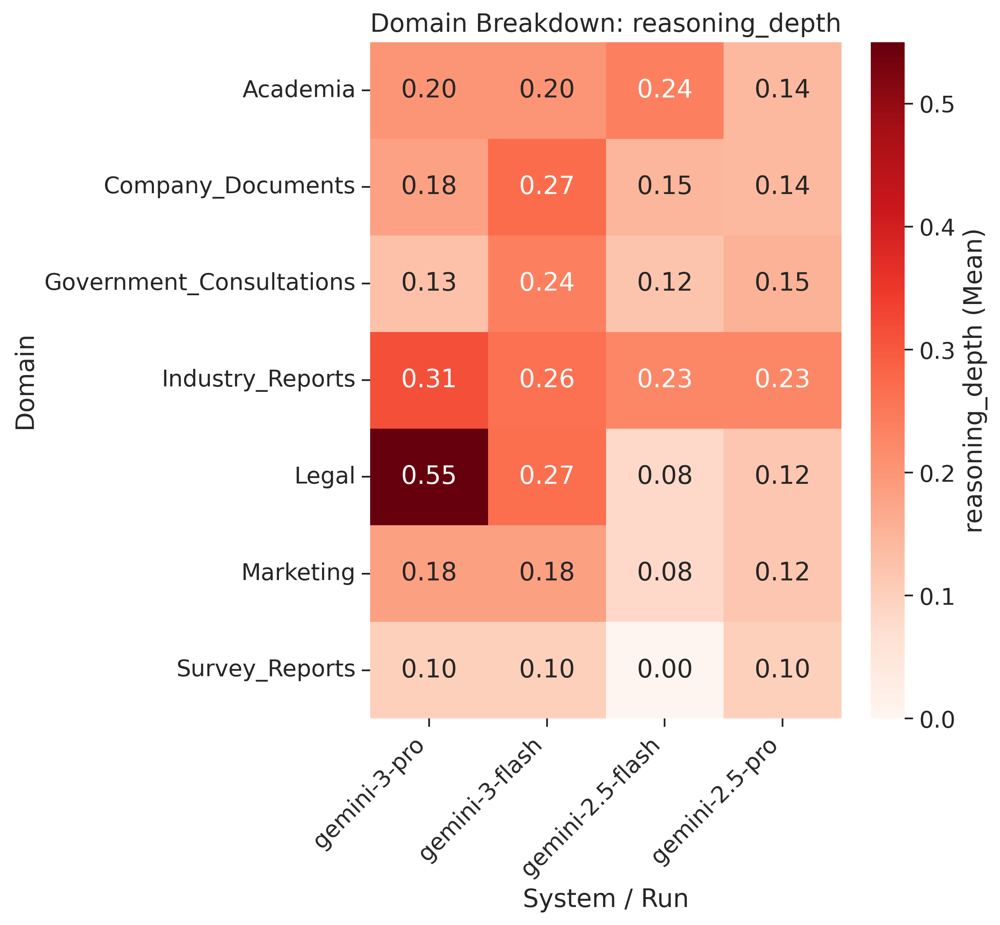
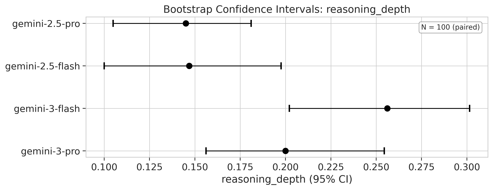
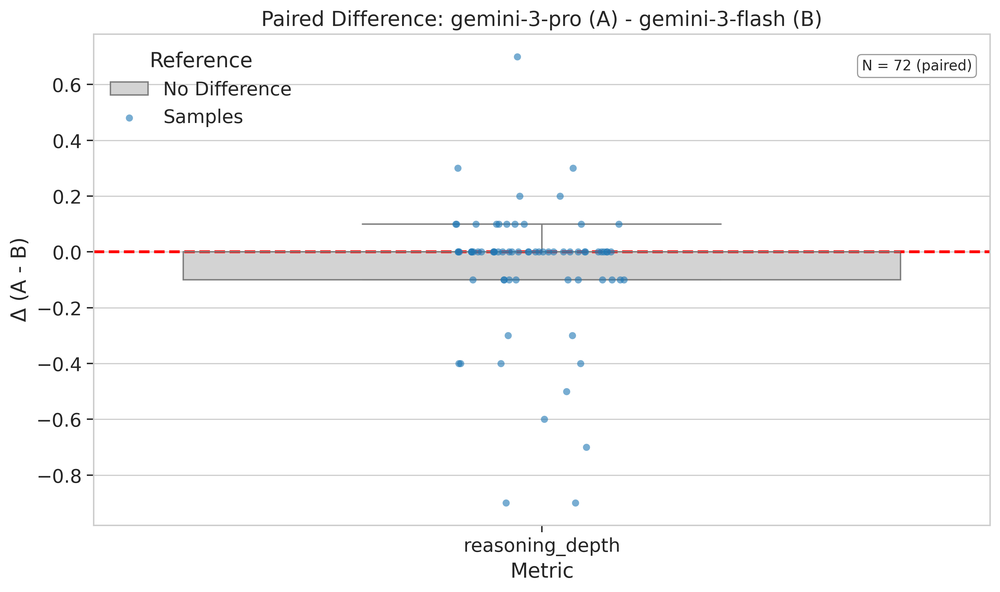
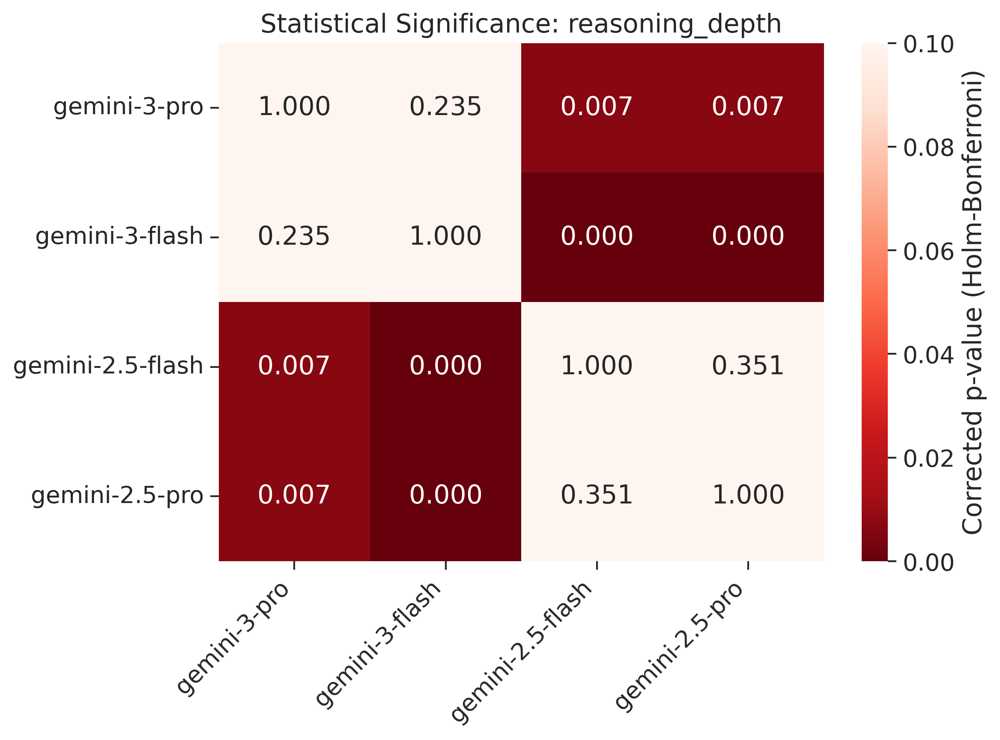
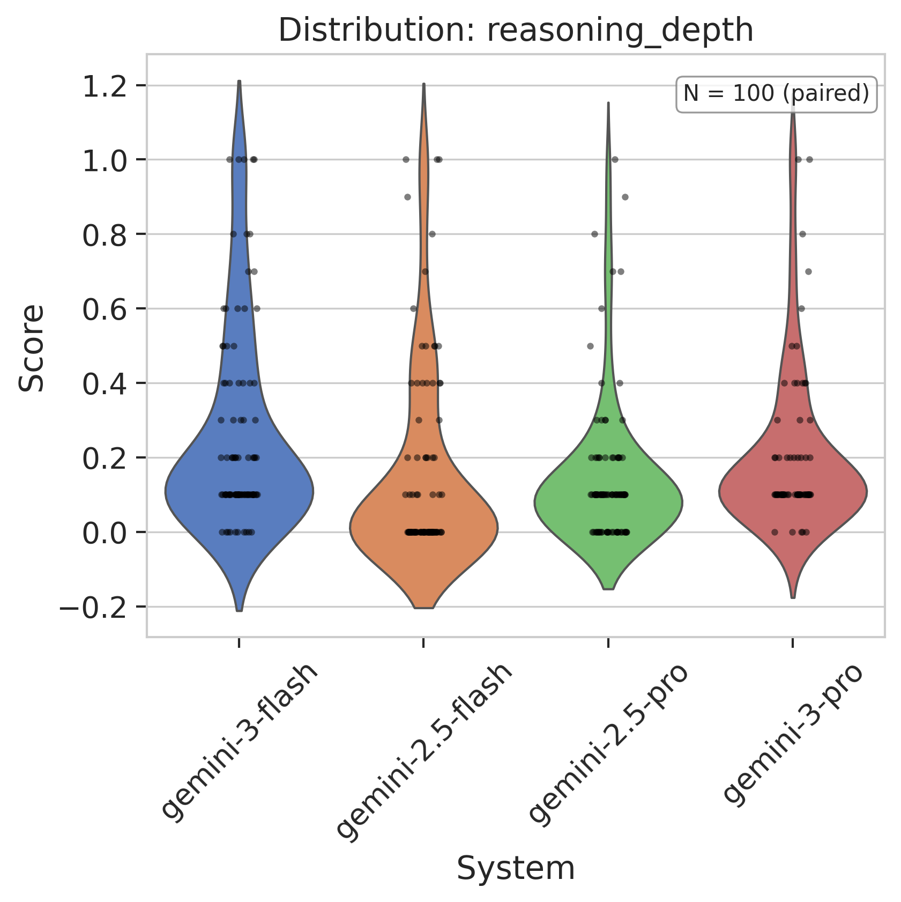
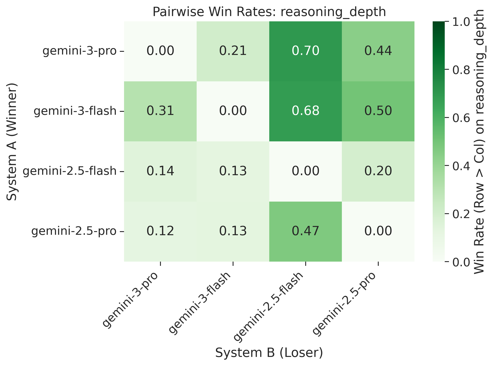

### Visualization Interpretation

This subsection provides a comprehensive analysis of model performance on the `reasoning_depth` metric, synthesizing insights from aggregate statistics, domain-specific breakdowns, and pairwise comparisons.

#### High-Level Performance and Generational Improvement

The visualizations collectively indicate a significant and statistically robust improvement in reasoning capabilities from the Gemini-2.5 generation to the Gemini-3 generation. The bootstrap confidence intervals show a clear separation between the two model families, with both `gemini-3-pro` and `gemini-3-flash` outperforming their predecessors. This observation is strongly corroborated by the statistical significance heatmap, which reports corrected p-values of less than 0.01 (specifically, p ≤ 0.007) for all cross-generation comparisons (e.g., `gemini-3-pro` vs. `gemini-2.5-pro`). The pairwise win-rate matrix further quantifies this dominance, with the Gemini-3 models winning against the Gemini-2.5 models in approximately 68-70% of head-to-head evaluations.

The score distributions, presented as violin plots, reveal that the `reasoning_depth` task is inherently challenging, with the majority of scores for all models clustered near zero. However, the distributions for the Gemini-3 models exhibit a more substantial upper tail, indicating a greater capacity to achieve higher levels of reasoning depth, albeit infrequently.

#### Nuanced Comparison of `gemini-3-pro` and `gemini-3-flash`

While the generational leap is clear, the comparison between the two Gemini-3 models is more nuanced. On aggregate, `gemini-3-flash` achieves a slightly higher mean score than `gemini-3-pro`. However, the statistical significance test reveals that this difference is not statistically significant (p=0.235), meaning we cannot conclude that one model is definitively superior to the other based on the overall mean.

The key to understanding their relative performance lies in the domain breakdown heatmap, which exposes a classic "specialist vs. generalist" profile:
*   **`gemini-3-pro` (The Specialist):** This model demonstrates high performance variance. It achieves a remarkable, state-of-the-art mean score of 0.55 in the "Legal" domain, more than double that of any other model in any domain. However, its performance in other domains like "Government_Consultations" (0.13) or "Survey_Reports" (0.10) is mediocre.
*   **`gemini-3-flash` (The Generalist):** This model exhibits much more consistent performance across the board. While it never reaches the peak performance of `gemini-3-pro`, it maintains a solid score (typically >0.20) across a wider range of domains, resulting in a more stable and slightly higher overall average.

This dynamic is further illuminated by the paired difference plot. The median difference is slightly negative, indicating that `gemini-3-flash` wins more frequently. However, the plot shows several large positive outliers, corresponding to instances where `gemini-3-pro` wins by a significant margin. This confirms that `gemini-3-pro`'s strength lies in its ability to excel on specific, likely more complex, examples where its deeper reasoning capabilities are triggered, consistent with its outlier performance in the "Legal" domain.

#### Interpretation of the `reasoning_depth` Metric

The metric `reasoning_depth` appears to evaluate the complexity and correctness of logical inference rather than stylistic or semantic similarity. Unlike fluency-focused metrics such as ROUGE (lexical overlap) or BERTScore (contextual embedding similarity), a high `reasoning_depth` score implies that a model can successfully deconstruct a complex prompt, perform multiple steps of inference, synthesize information, and arrive at a logically sound conclusion.

The fact that model performance is highly sensitive to the domain reinforces this interpretation. The "Legal" domain, which requires processing dense, structured text and applying precise logical rules, serves as a powerful differentiator, allowing `gemini-3-pro` to showcase its superior capabilities. In contrast, performance is uniformly low in "Survey_Reports," suggesting this domain may require a type of reasoning that is challenging for all models evaluated. This metric, therefore, provides a much clearer signal of a model's advanced cognitive abilities than what would be captured by simple text-generation metrics.

#### Key Takeaways

1.  **Clear Generational Leap:** The Gemini-3 series models are statistically and practically superior to the Gemini-2.5 series in `reasoning_depth`, demonstrating a significant advancement in complex reasoning.
2.  **No Single Best Model Overall:** On aggregate, `gemini-3-pro` and `gemini-3-flash` are statistically indistinguishable. The choice between them depends on the desired application.
3.  **Specialist vs. Generalist Trade-off:** `gemini-3-pro` is a high-variance "specialist" that achieves unparalleled performance in specific, complex domains like Legal, while `gemini-3-flash` is a more consistent and reliable "generalist" across a broader set of domains.
4.  **Domain Sensitivity is Critical:** Performance on `reasoning_depth` is not uniform. The evaluation highlights the "Legal" domain as a key benchmark for differentiating high-capability models, suggesting that future work should emphasize domain-specific analysis to uncover such nuanced performance differences.

---

## Analysis of Metric: `refusal_rate`

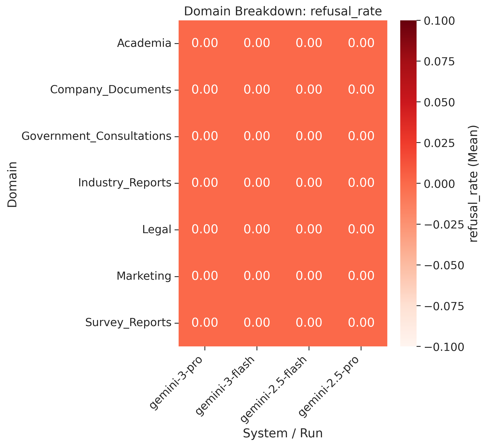
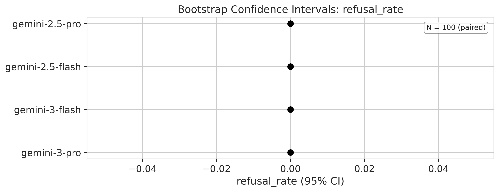
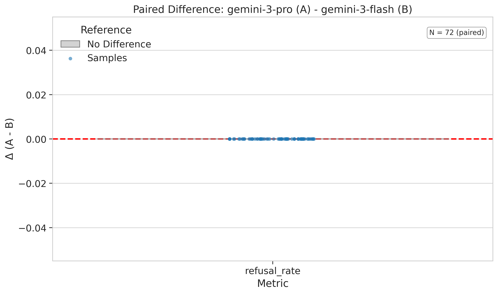

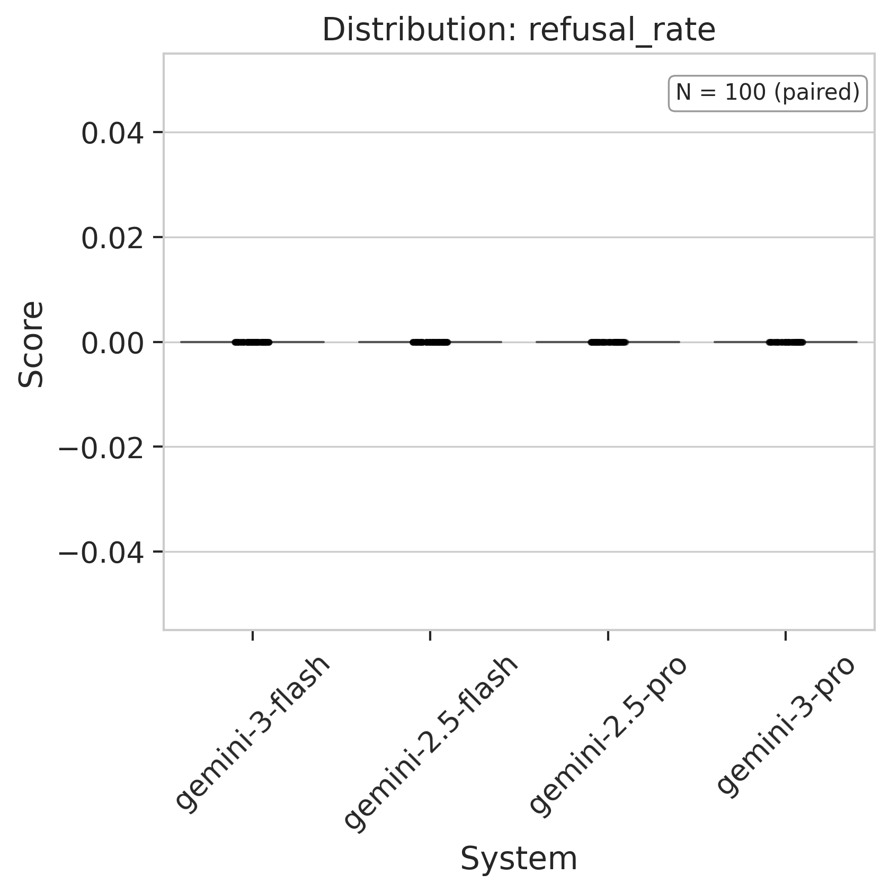
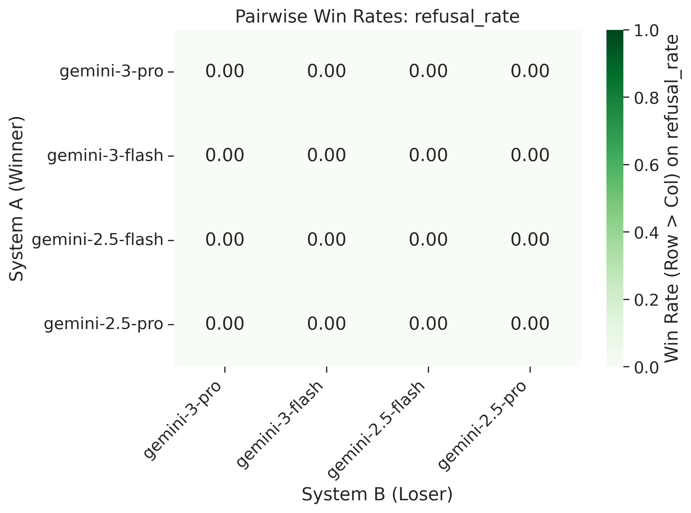

### Visualization Interpretation

This subsection provides a detailed analysis of the model performance on the `refusal_rate` metric, drawing insights from a suite of visualizations generated by the GLASS evaluation harness.

#### 1. PhD-Level Interpretation of Trends

The collective evidence from the provided visualizations points to a clear and unequivocal conclusion: all four evaluated systems—`gemini-3-pro`, `gemini-3-flash`, `gemini-2.5-flash`, and `gemini-2.5-pro`—exhibit a **perfectly zero refusal rate** across the entire evaluation set. This is not merely a low rate, but a complete absence of refusals.

-   The **Domain Breakdown heatmap** is the most direct evidence, displaying a value of 0.00 for every model across every single tested domain (e.g., Academia, Legal, Marketing). This indicates that the models did not refuse to answer any prompt, regardless of its topical context.
-   This observation is statistically corroborated by multiple other views. The **Bootstrap Confidence Intervals** for each model are collapsed into a single point at precisely 0.00, indicating zero variance in the bootstrapped means. This is only possible if every underlying data point is identical (i.e., zero).
-   Similarly, the **Distribution boxplot** for each system is flattened into a single line at a score of 0, confirming that the minimum, first quartile, median, third quartile, and maximum scores are all zero. This signifies a total lack of spread in the data.
-   The **Paired Difference** plot, comparing `gemini-3-pro` and `gemini-3-flash`, shows all sample differences aligned perfectly on the "No Difference" line at zero, reinforcing that on a per-prompt basis, the models behaved identically.
-   Finally, the **Statistical Significance** heatmap shows corrected p-values of 1.000 for all pairwise comparisons. This formally confirms that there is no statistically significant difference between any of the models' refusal rates because their performance is identical. The **Pairwise Win Rates** chart further supports this, with all win rates at 0.00, indicating no model ever performed differently (better or worse) than another; every outcome was a tie.

#### 2. Key Takeaways

1.  **Flawless Compliance:** All tested Gemini models demonstrated flawless compliance within this evaluation context, never refusing a single prompt. This suggests a high degree of utility and robustness against task-related refusals for the types of queries present in this benchmark.

2.  **Absolute Performance Parity:** On the metric of `refusal_rate`, the models are completely indistinguishable. There is no performance gap, however small, between the 'pro' and 'flash' variants or across generations (2.5 vs. 3).

3.  **Domain Invariance:** The models' perfect non-refusal performance is not an averaged result masking domain-specific issues. Performance is uniformly perfect across all domains, from technical and formal (e.g., Legal, Government Consultations) to creative and commercial (e.g., Marketing).

#### 3. Consistency vs. Domain Sensitivity

A key aspect of this analysis is the comparison between the global and domain-specific views. In this case, there is a **lack of contrast**, which is itself a significant finding. The global metrics (confidence intervals, overall distributions) show a perfect score of zero, and the domain-breakdown heatmap confirms that this perfect performance is not an artifact of aggregation. The models' behavior is entirely consistent and insensitive to the topical domain of the input prompts, demonstrating robustly predictable behavior in terms of their willingness to engage with a task.

#### 4. Interpretation of `refusal_rate` as a Behavioral Metric

It is critical to interpret the `refusal_rate` metric correctly. This is a **behavioral metric** that measures a model's willingness to respond, not the quality of the response itself.

-   **What this result means:** The zero refusal rate indicates that the models did not exhibit overly conservative safety behaviors or an inability to understand the tasks presented in the benchmark. They consistently generated a substantive response rather than a canned refusal (e.g., "I cannot help with that request").
-   **What this result does not mean:** This score provides no information about the factual accuracy, semantic relevance, fluency, or coherence of the generated text. A model could achieve a perfect zero refusal rate by consistently providing incorrect or nonsensical answers. Therefore, this result should be interpreted as a measure of model **utility and accessibility**, not its core semantic or reasoning capabilities. It is a necessary but insufficient condition for a high-quality system. This metric would need to be analyzed alongside correctness metrics (e.g., `exact_match`, `quasi_exact_match`) and semantic similarity metrics (e.g., `bert_score_f1`, `rouge_score`) to form a complete picture of model performance.

---

## Analysis of Metric: `response_consistency`

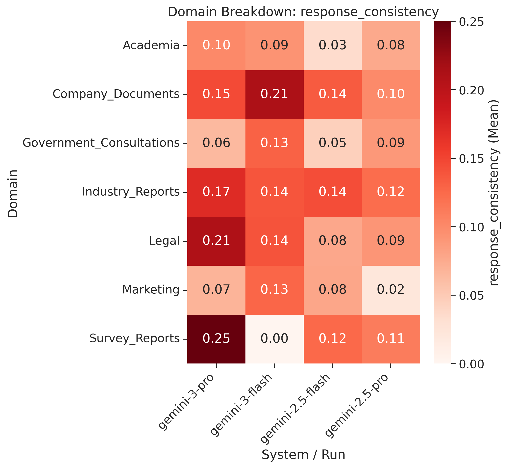
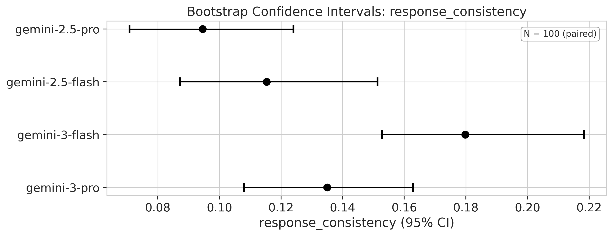
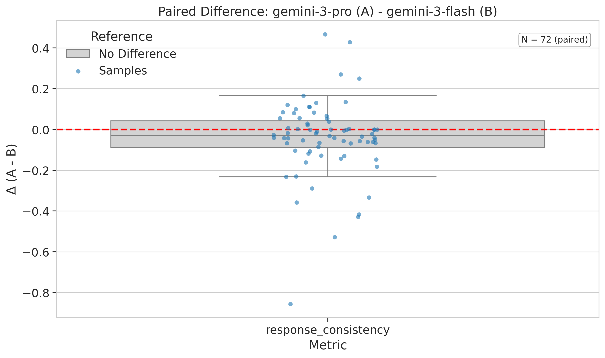
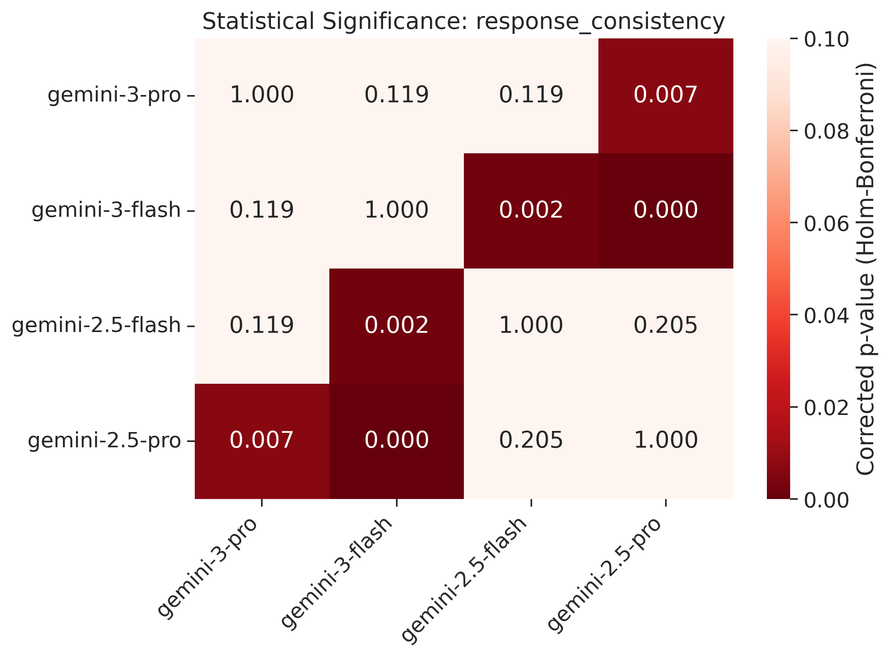
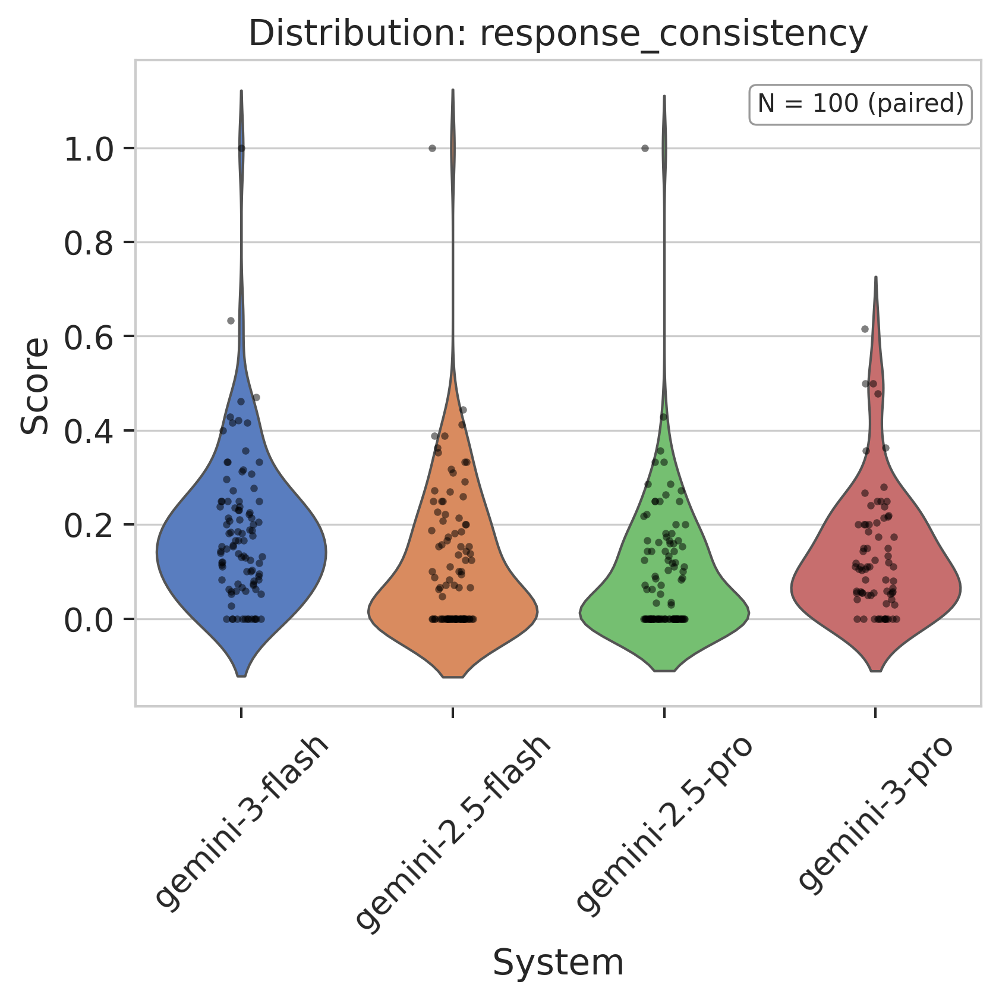
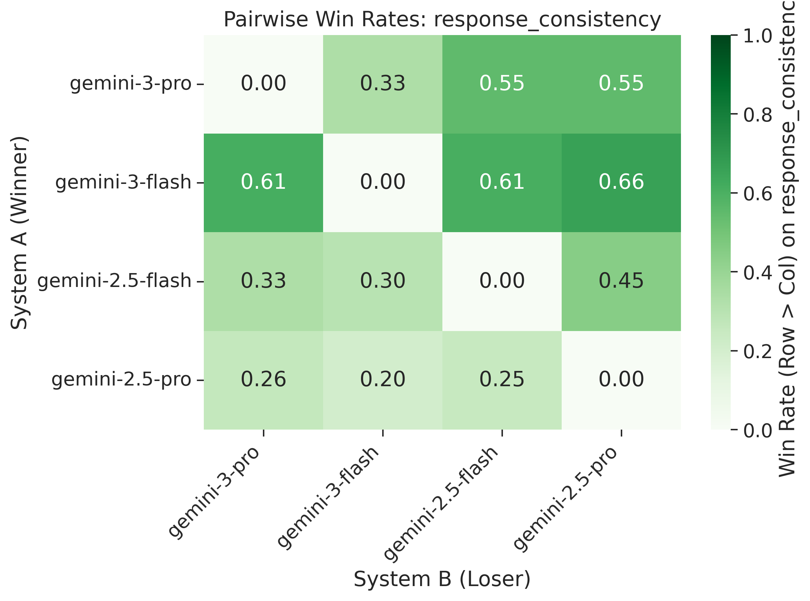

### Visualization Interpretation

This subsection provides a detailed analysis of the `response_consistency` metric for four Gemini models, based on a suite of visualizations generated from the GLASS evaluation harness. The `response_consistency` metric is interpreted as a measure of a model's semantic stability—its ability to produce semantically equivalent outputs when faced with paraphrased or slightly altered inputs that should elicit the same information. This differs from strict correctness, as it relies on semantic similarity scores (e.g., BERTScore), rewarding models that maintain the meaning of their answers even if the exact phrasing changes.

#### 1. PhD-Level Interpretation of Trends

The collective evidence from the visualizations paints a nuanced picture of model performance, characterized by a clear hierarchy between model families, significant performance variability across domains, and a lack of a single dominant model.

-   **Global Performance Hierarchy:** The bootstrap confidence intervals (CI) and statistical significance tests establish a clear performance ranking. `gemini-3-flash` achieves the highest mean consistency score (≈0.18), followed by `gemini-3-pro` (≈0.13), with `gemini-2.5-flash` and `gemini-2.5-pro` trailing behind. The statistical significance heatmap confirms that the Gemini 3 series models significantly outperform `gemini-2.5-pro` (p < 0.01). Furthermore, `gemini-3-flash` shows a statistically significant improvement over its `gemini-2.5-flash` predecessor (p = 0.002). However, the performance difference between `gemini-3-pro` and `gemini-3-flash` is not statistically significant (p = 0.119), a crucial finding corroborated by their overlapping CIs.

-   **Distribution and Variance:** The violin plots reveal that all models exhibit a right-skewed distribution, with the majority of scores clustered near zero. This indicates that achieving high response consistency is a challenging task, and models frequently fail to produce semantically stable outputs. `gemini-3-flash`, despite its higher mean, also displays the widest distribution, suggesting greater variance in its performance compared to the other models. This is further supported by its wider confidence interval.

-   **Pairwise Comparisons:** The pairwise win-rate matrix reinforces the leadership of `gemini-3-flash`, which outperforms all other models in over 60% of head-to-head comparisons. The paired difference plot between `gemini-3-pro` and `gemini-3-flash` illustrates that while `gemini-3-flash` wins more often (the median difference is below zero), the outcome is highly instance-dependent, with a wide spread of differences in both positive and negative directions.

#### 2. Key Takeaways

1.  **Gemini 3 Series Surpasses 2.5:** There is a statistically significant and substantial improvement in response consistency from the Gemini 2.5 to the Gemini 3 model family.
2.  **`gemini-3-flash` Leads on Average, But Is Not a Clear Winner:** Globally, `gemini-3-flash` is the top-performing model. However, its advantage over `gemini-3-pro` is not statistically significant, and its performance is highly variable and domain-sensitive.
3.  **Performance is Critically Domain-Dependent:** A model's global average score can be misleading. Performance on `response_consistency` is not uniform; models exhibit strong "spikes" in specific domains (e.g., `gemini-3-pro` in `Survey_Reports`) and weaknesses in others, indicating that model choice may need to be tailored to the specific application domain.
4.  **Consistency Remains a Challenge:** The low absolute scores across all models and domains (most means are below 0.25) highlight that maintaining semantic consistency in structured generation tasks is an open and difficult problem for current state-of-the-art models.

#### 3. Contrast: Global vs. Domain-Specific Performance

Contrasting the global confidence intervals with the domain breakdown heatmap reveals critical inconsistencies. While the global view suggests `gemini-3-flash` is the best model, the domain-level analysis challenges this conclusion.

-   `gemini-3-flash`'s high global average is largely driven by its strong performance in `Company_Documents` (0.21). In contrast, it fails completely on `Survey_Reports` (0.00).
-   Conversely, `gemini-3-pro`, which ranks second globally, is the top performer in `Legal` (0.21) and dramatically outperforms all other models, including `gemini-3-flash`, in `Survey_Reports` (0.25 vs. 0.00).
-   This discrepancy underscores the risk of relying solely on aggregate metrics. The global average obscures domain-specific strengths and catastrophic failures, demonstrating that the models have likely specialized in different types of document structures or linguistic patterns present in the various domains.

#### 4. Interpretation of the `response_consistency` Metric

The use of a semantic similarity-based metric like `response_consistency` evaluates a model's ability to preserve meaning rather than rigid textual form. The observed low scores suggest that while models might generate syntactically correct outputs, they struggle to consistently identify and extract the same semantic concepts when prompts are perturbed. For example, a model might extract "net profit" in one instance and "earnings" in another; while semantically related, this variance is penalized by the consistency metric. This highlights a deficit in robust semantic grounding. The models are sensitive to surface-level changes in the input, leading to semantically different, and therefore inconsistent, structured outputs. This is a higher-order capability than simple format adherence and appears to be a key area for future model improvement.

---

## Analysis of Metric: `rouge_score_f1`

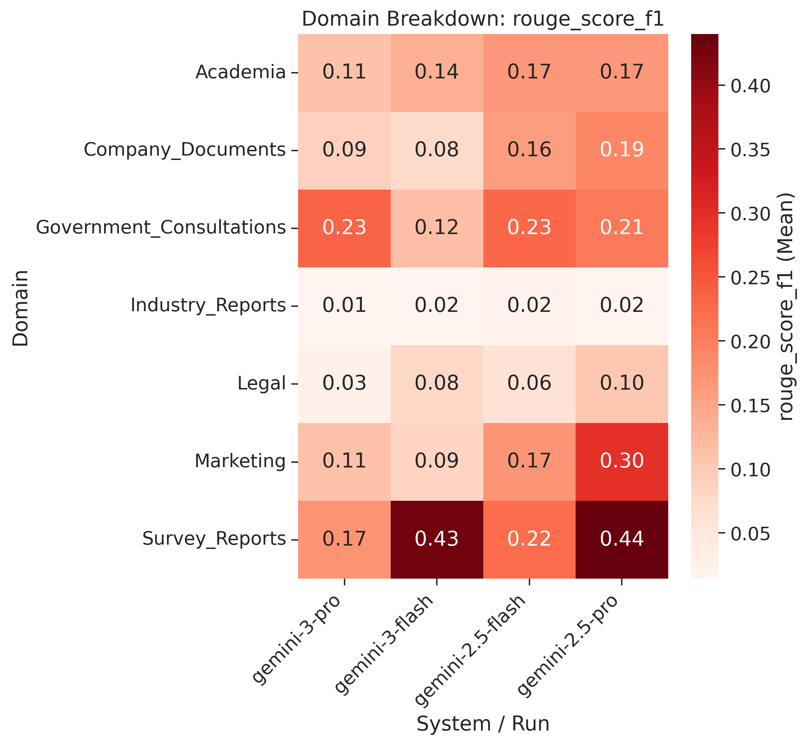
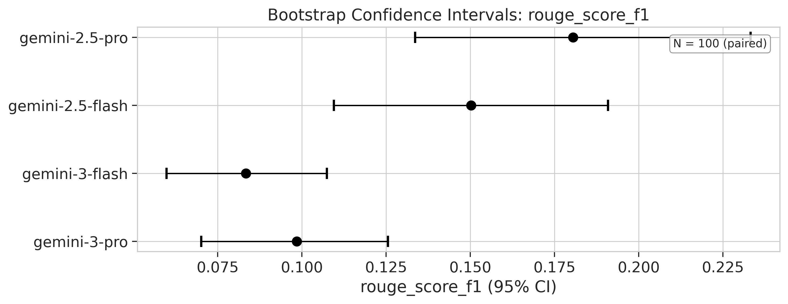
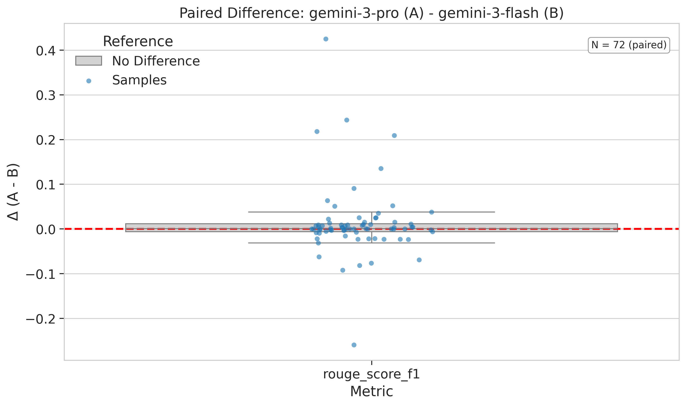
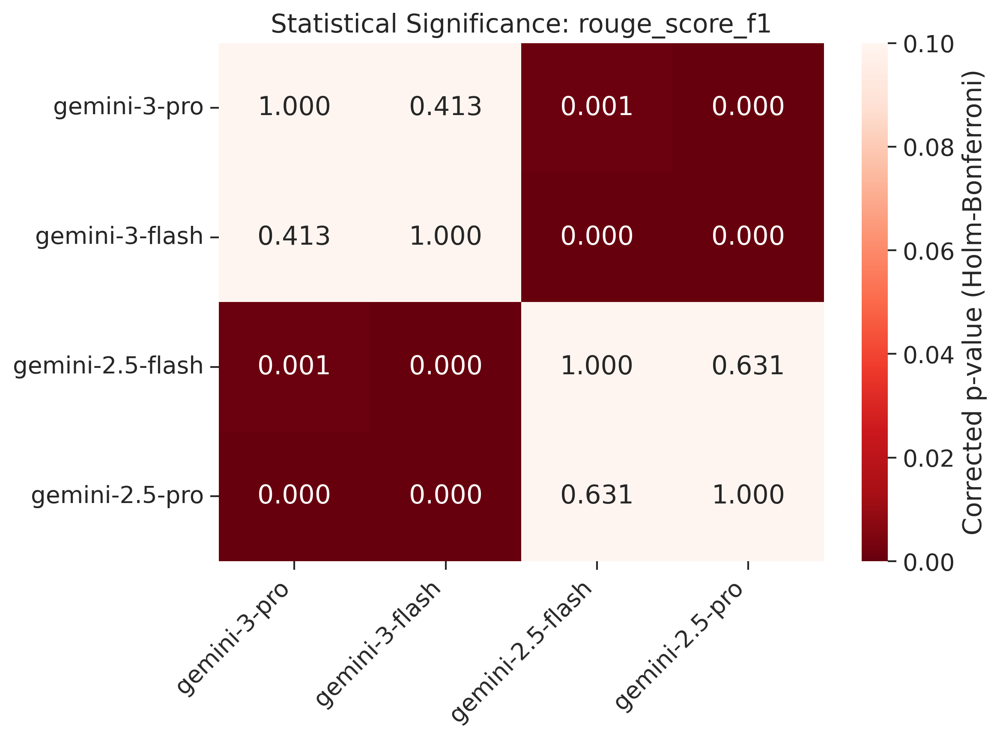
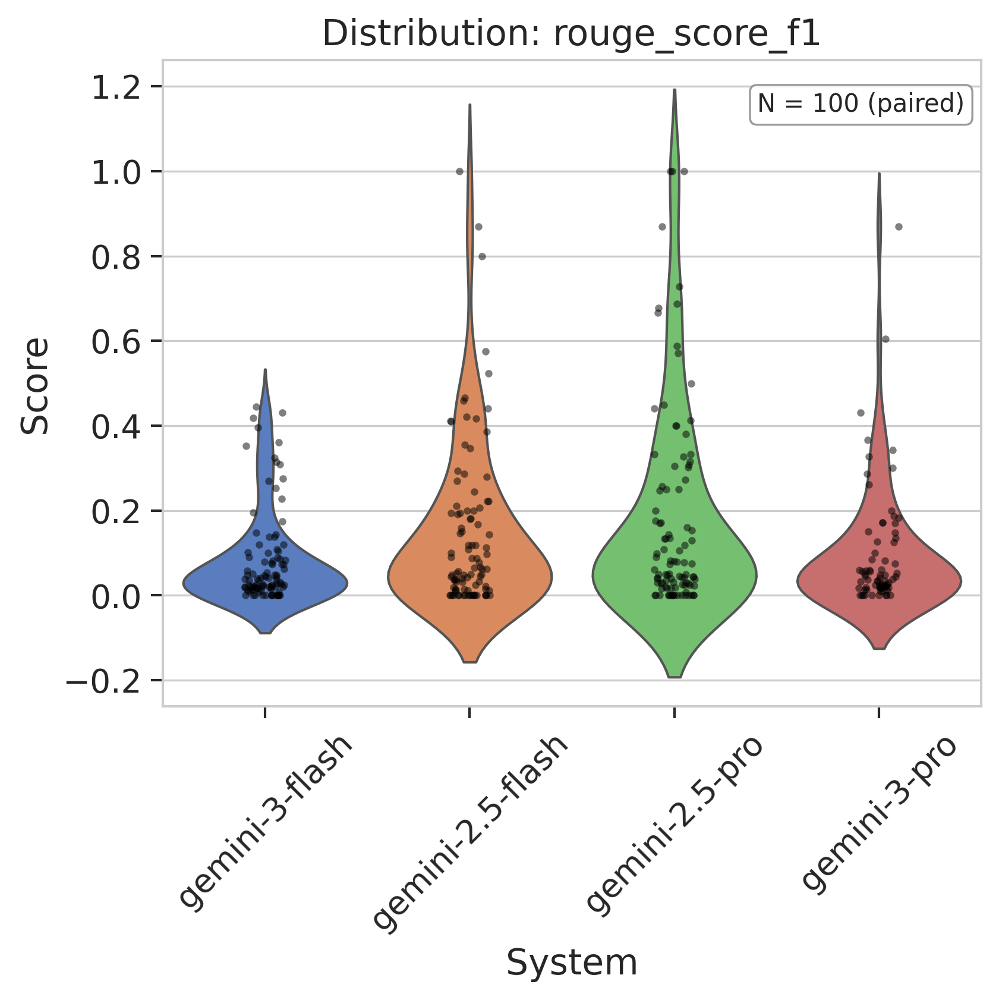
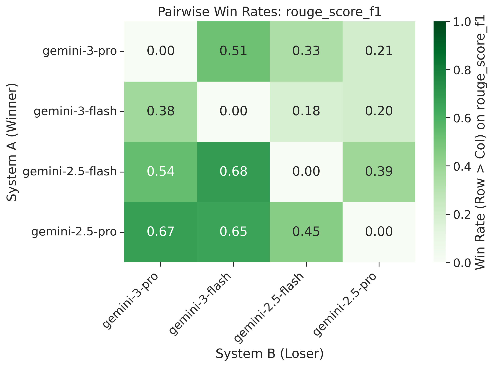

### Visualization Interpretation

This subsection provides a comprehensive analysis of the model performance on the `rouge_score_f1` metric, synthesizing findings from global statistical views and fine-grained domain breakdowns.

#### 1. PhD-Level Interpretation of Trends

The collective visualizations present a multi-faceted view of model performance, revealing a clear hierarchical structure and significant domain-specific sensitivities. The primary trend, robustly supported by bootstrap confidence intervals (Figure 2), statistical significance testing (Figure 4), and distributional plots (Figure 5), is the **statistically significant superiority of the Gemini 2.5 generation over the Gemini 3 generation**. The confidence intervals for `gemini-2.5-pro` and `gemini-2.5-flash` are clearly separated from and higher than those for `gemini-3-pro` and `gemini-3-flash`. The pairwise significance heatmap corroborates this, with all inter-generation comparisons yielding corrected p-values of ≤ 0.001, indicating high confidence in this performance gap.

However, this global view is heavily nuanced by the domain breakdown analysis (Figure 1). Performance is not monolithic; rather, it is highly dependent on the topical domain. For example, the `Survey_Reports` domain elicits exceptionally high performance from `gemini-2.5-pro` (0.44) and `gemini-3-flash` (0.43), scores that are more than double their global averages. Conversely, the `Industry_Reports` domain proves universally challenging, with all models achieving near-zero scores, suggesting a fundamental misalignment between the models' outputs and the reference texts for this domain. This "spiky" performance profile indicates that global average metrics, while useful for a high-level ranking, obscure critical model specializations and weaknesses.

The paired difference plot for `gemini-3-pro` vs. `gemini-3-flash` (Figure 3) and the p-value of 0.413 (Figure 4) confirm that there is no statistically significant difference in mean performance between these two models. A similar lack of significance is observed between `gemini-2.5-pro` and `gemini-2.5-flash` (p=0.631). The violin plots (Figure 5) further characterize the score distributions, showing that all models produce a high density of scores near zero but that the Gemini 2.5 models exhibit a longer and heavier tail of high-scoring outputs, driving their superior mean performance.

#### 2. Key Takeaways

1.  **Clear Generational Performance Gap:** There is a statistically significant performance advantage for the Gemini 2.5 models (`pro` and `flash`) over the Gemini 3 models on the `rouge_score_f1` metric.
2.  **Performance is Highly Domain-Sensitive:** The choice of the "best" model is heavily context-dependent. Global performance metrics are insufficient for model selection in specialized applications. For instance, while `gemini-2.5-pro` is the top performer on average, `gemini-3-flash` is a strong competitor specifically for `Survey_Reports`.
3.  **Certain Domains are Universally Challenging:** All evaluated models fail to generate lexically similar text for the `Industry_Reports` domain, pointing to a potential issue with the task's formulation, the reference data, or a shared architectural limitation in handling this type of content.
4.  **No Significant Difference Within Generations:** On average, the performance difference between the `pro` and `flash` variants within each generation is not statistically significant for this metric.

#### 3. Contrasting Global vs. Domain-Specific Views

Contrasting the global confidence intervals (Figure 2) with the domain breakdown heatmap (Figure 1) is crucial. The CI plot provides a simple, clear ranking: `gemini-2.5-pro` > `gemini-2.5-flash` > `gemini-3-pro` ≈ `gemini-3-flash`. This ranking, however, represents an average that homogenizes diverse behaviors.

The domain heatmap shatters this simple picture. It reveals that the strong global performance of `gemini-2.5-pro` is disproportionately driven by its outstanding scores in `Survey_Reports` (0.44) and `Marketing` (0.30). In other domains like `Academia` and `Government_Consultations`, its performance is more modest and comparable to the Gemini 3 models. Similarly, the globally poor performance of `gemini-3-flash` masks its exceptional capability in the `Survey_Reports` domain (0.43), where it outperforms even `gemini-2.5-pro`. This demonstrates that performance is not a consistent attribute of a model but is instead highly sensitive to the topical domain. Relying solely on the global view would lead to suboptimal model selection for domain-specific tasks.

#### 4. Interpreting `rouge_score_f1`: Semantic vs. Lexical Fidelity

The `rouge_score_f1` metric evaluates performance based on n-gram overlap between the generated output and a ground-truth reference. It is a measure of **lexical fidelity** and format adherence, not deep semantic understanding. A high ROUGE score indicates that the model has successfully reproduced key phrases and terminology from the reference text. This is often a good proxy for factual correctness and content selection in summarization tasks.

The observed results must be interpreted through this lens. The high scores in `Survey_Reports` suggest that the task in this domain may involve extracting and presenting specific data points or boilerplate phrases that the top models replicate well. The near-zero scores in `Industry_Reports` imply a near-total failure to match the reference text's wording. This could mean the models are generating semantically plausible but heavily paraphrased summaries, hallucinating content, or failing to adhere to a rigid expected structure.

The lower scores of the newer Gemini 3 models are particularly interesting. This does not automatically imply they are "worse" models. It could indicate a shift in their generative behavior towards more abstractive and paraphrastic outputs. A model that accurately captures the meaning of the source but uses novel phrasing would be penalized by ROUGE. Without complementary semantic metrics like `bert_score_f1`, which measures contextual embedding similarity, we cannot definitively conclude that the Gemini 3 models have regressed. It is plausible they are generating more sophisticated, less extractive summaries that are lexically divergent from the reference, a hypothesis that warrants further investigation with semantic similarity metrics.

---

## Analysis of Metric: `rouge_score_recall`

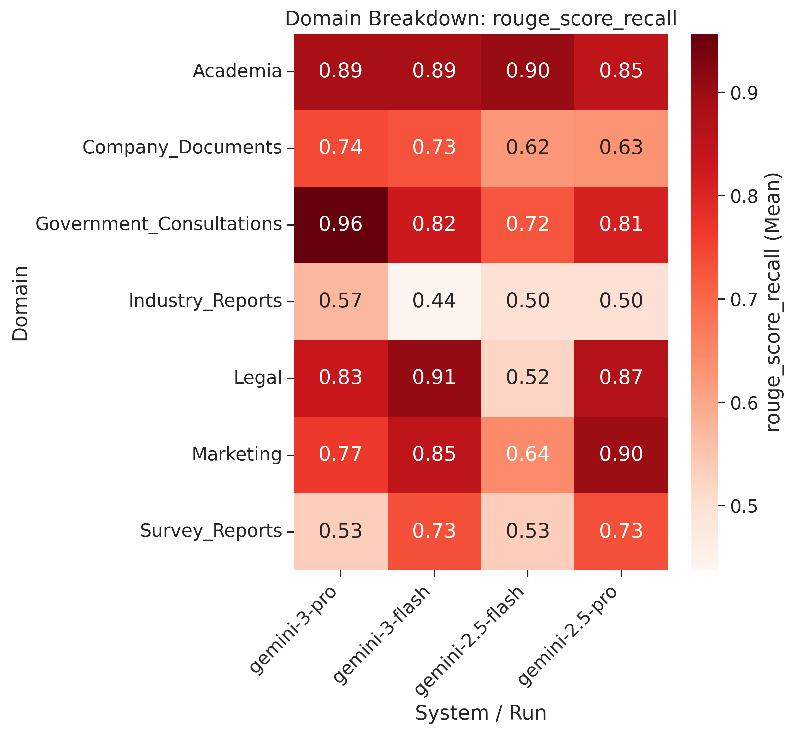
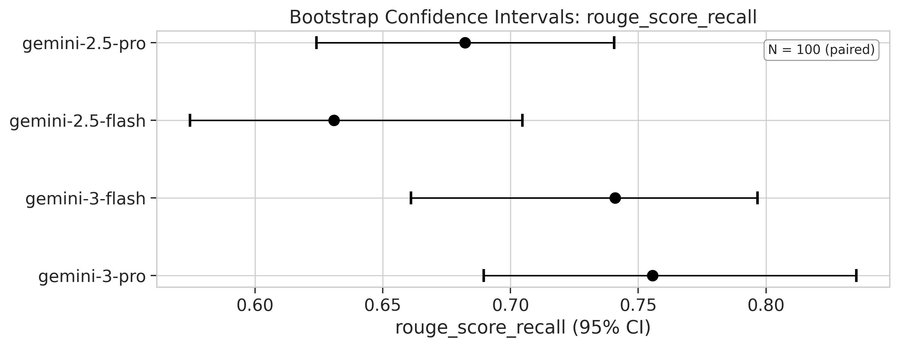
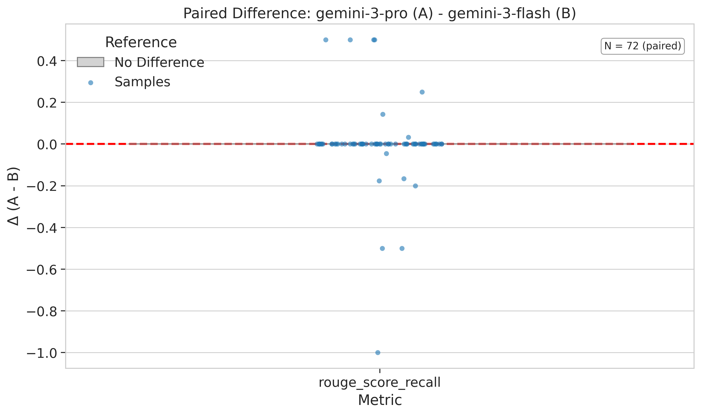
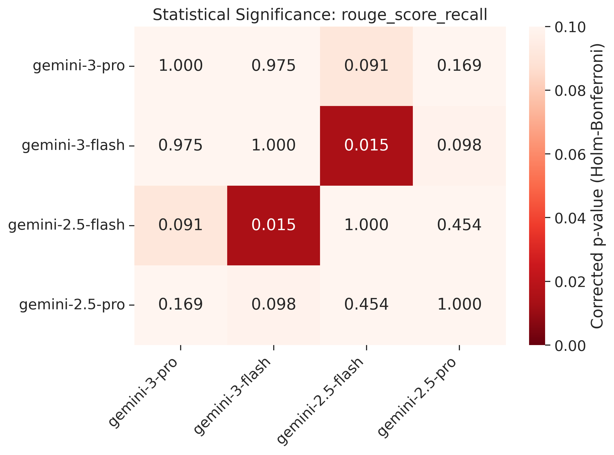
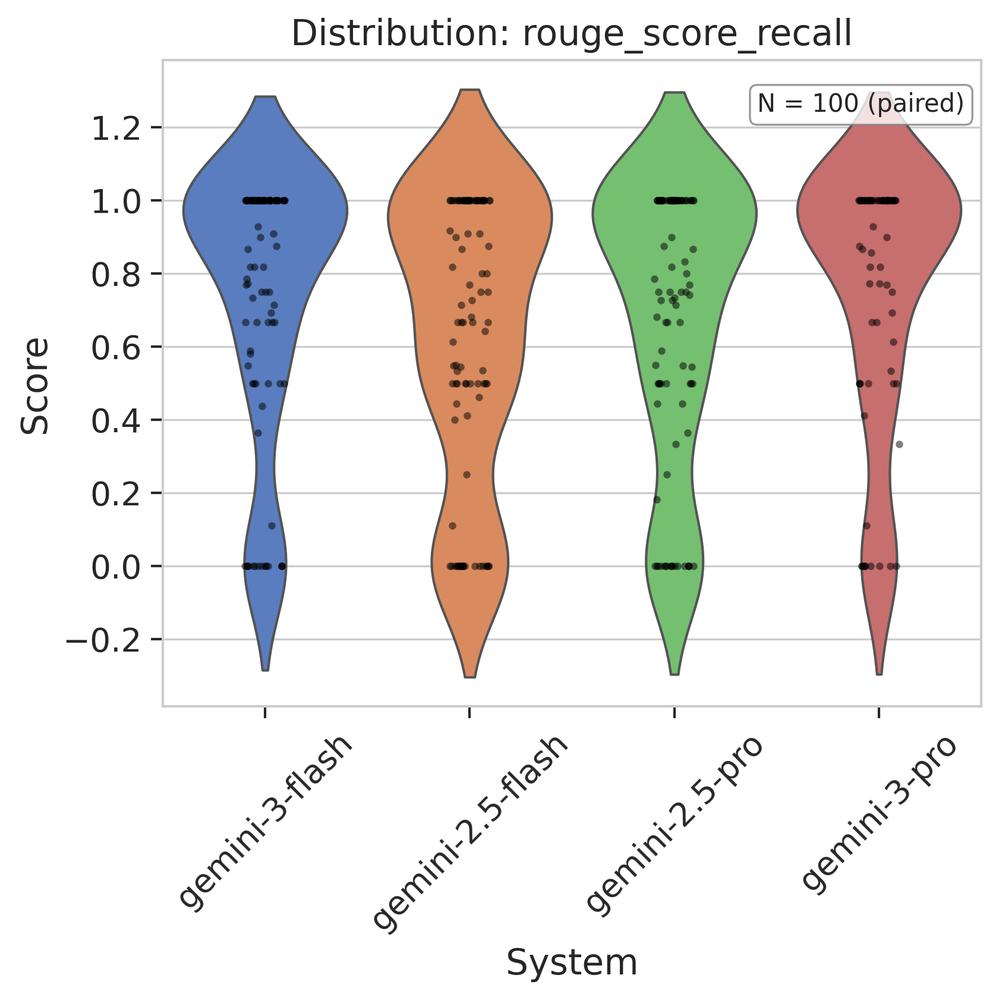
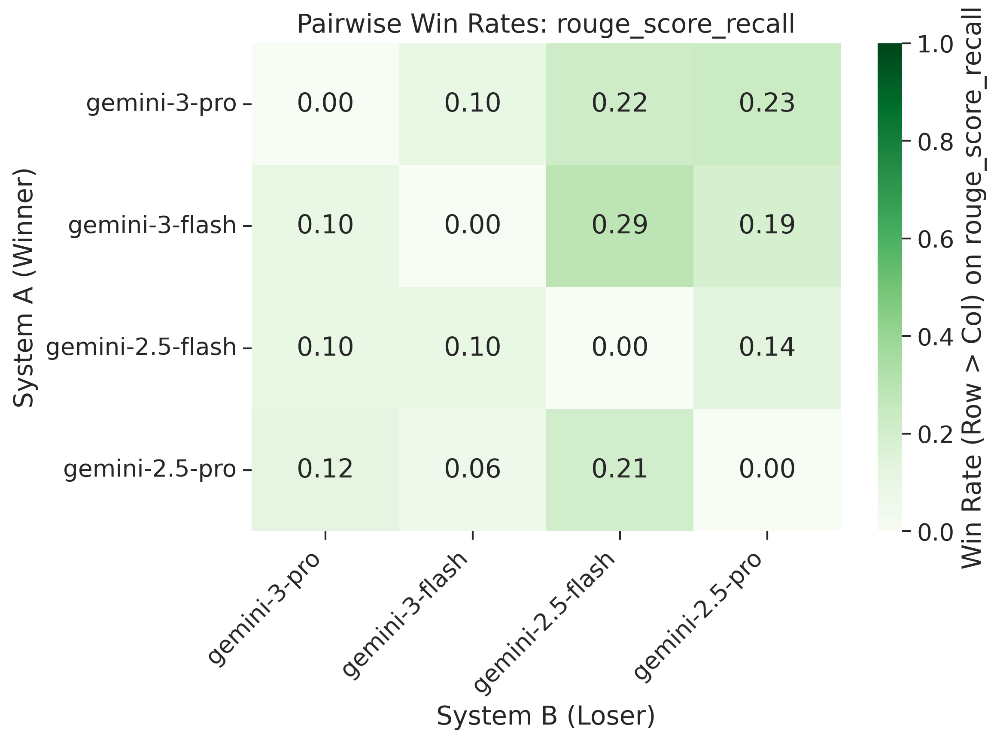

### Visualization Interpretation

This subsection provides a comprehensive analysis of the `rouge_score_recall` metric across four generative models, synthesizing insights from multiple visualizations including domain-level breakdowns, bootstrap confidence intervals, and statistical significance tests.

#### 1. Overall Performance and Model Ranking

The aggregate performance, as shown in the Bootstrap Confidence Intervals plot, reveals a clear two-tiered ranking among the evaluated systems. The newer generation models, `gemini-3-pro` (mean recall ≈ 0.75) and `gemini-3-flash` (mean recall ≈ 0.74), form the top tier, exhibiting substantially higher mean `rouge_score_recall` than their predecessors, `gemini-2.5-pro` (≈ 0.69) and `gemini-2.5-flash` (≈ 0.64).

The statistical significance heatmap provides robust validation for this hierarchy. A statistically significant difference (p=0.015, Holm-Bonferroni corrected) is observed between `gemini-3-flash` and `gemini-2.5-flash`, confirming a tangible improvement in the newer, more efficient model. While the differences between `gemini-3-pro` and the `gemini-2.5` series do not meet the p < 0.05 threshold, the trend is consistent. Crucially, there is no statistically significant difference between `gemini-3-pro` and `gemini-3-flash` (p=0.975). This is further corroborated by the Paired Difference plot, which shows most performance deltas clustering tightly around zero, and the Pairwise Win Rate chart, which indicates an 80% tie rate between them. This suggests that for this metric, the more efficient `-flash` model provides a level of content coverage on par with the larger `-pro` model.

#### 2. Interpretation of `rouge_score_recall`

The `rouge_score_recall` metric evaluates the n-gram overlap between the model-generated output and a reference text, specifically measuring the proportion of n-grams from the reference that are present in the generation. In this context, a high recall score signifies that the model is proficient at including the key information and phrasing from the reference document. It is a measure of **content coverage and lexical fidelity** to the ground truth.

However, this metric must be interpreted with caution. Unlike semantic similarity metrics (e.g., `bert_score_f1`), ROUGE is insensitive to paraphrasing; a model could generate a semantically equivalent but lexically different output and be unduly penalized. Furthermore, high ROUGE recall does not guarantee factual correctness or coherence, as it only measures overlap with a reference, not the intrinsic quality or veracity of the generated text itself. It is a useful proxy for information inclusion, particularly in summarization or question-answering tasks where reproducing key terms is desirable.

#### 3. Domain Sensitivity and Performance Variance

Contrasting the global confidence intervals with the domain-specific breakdown reveals a critical insight: **aggregate performance masks profound domain-specific variability**. While the overall ranking is clear, model effectiveness is highly sensitive to the topical domain.

- **High-Performance Domains:** Models demonstrate exceptional `rouge_score_recall` in domains like `Government_Consultations` (`gemini-3-pro` at 0.96), `Academia` (0.85-0.90), and `Legal` (0.83-0.91 for top models). This suggests the models excel at identifying and reproducing the salient, often formulaic, language characteristic of these structured document types.

- **Low-Performance Domains:** Conversely, all systems struggle significantly with `Industry_Reports` (scores ranging from 0.44 to 0.57) and, to a lesser extent, `Survey_Reports`. This indicates that the lexical content of these domains is either more complex for the models to capture or that the models tend to paraphrase more heavily, reducing n-gram overlap.

- **Rank Inversions:** The domain breakdown also highlights that the global ranking is not absolute. For example, `gemini-3-flash` outperforms `gemini-3-pro` in both the `Legal` (0.91 vs. 0.83) and `Marketing` (0.85 vs. 0.77) domains, suggesting its capabilities may be better aligned with the linguistic patterns of certain specialized topics.

#### 4. Key Takeaways

1.  **Clear Generational Superiority:** The Gemini 3 series models demonstrate a significant and statistically robust improvement in content recall over the Gemini 2.5 series.
2.  **Performance Parity between `pro` and `flash`:** On average, the `gemini-3-flash` model achieves `rouge_score_recall` statistically indistinguishable from its larger `gemini-3-pro` counterpart, presenting a favorable performance-per-compute trade-off.
3.  **High Domain Sensitivity:** Global metrics are insufficient for a complete evaluation. Performance is highly dependent on the document domain, with models excelling in structured areas like legal and academic texts but faltering in others, a factor that must be considered in deployment.
4.  **Lexical Fidelity vs. Semantic Understanding:** The strong performance in certain domains indicates a high degree of lexical fidelity to the reference material. This is a strength for tasks requiring information extraction but should not be conflated with deeper semantic comprehension or factual accuracy, which would require complementary metrics for a full assessment.

---

## Analysis of Metric: `soft_f1`

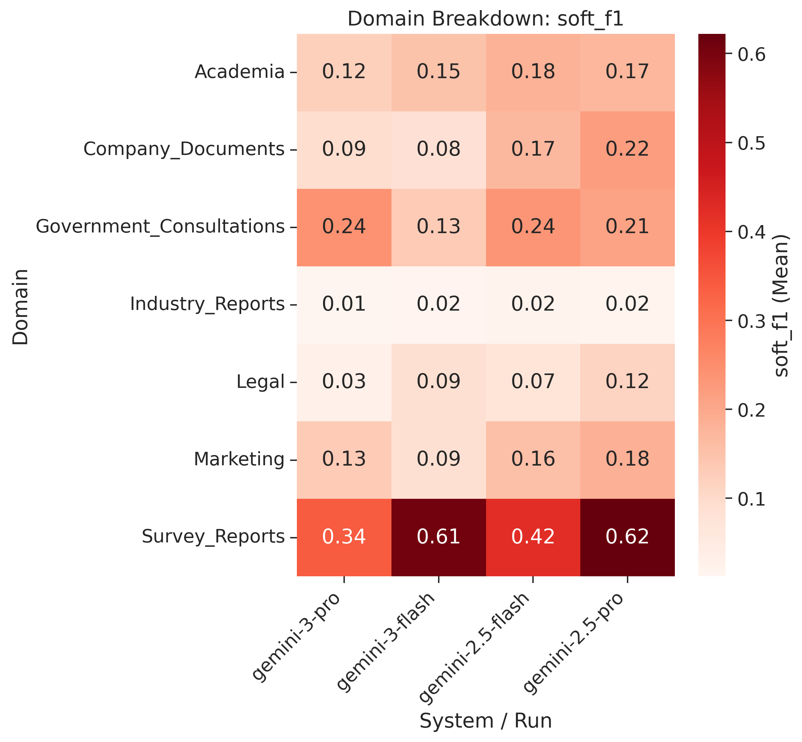
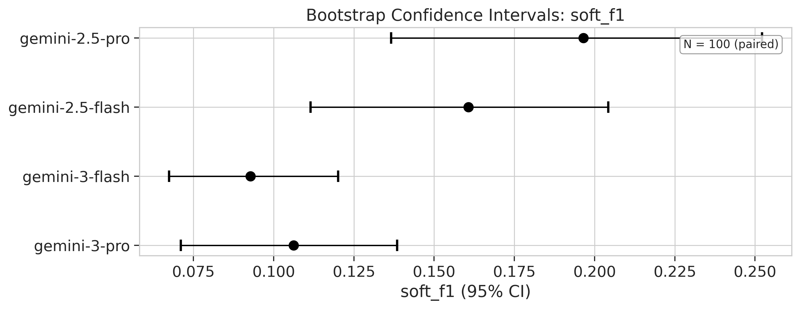
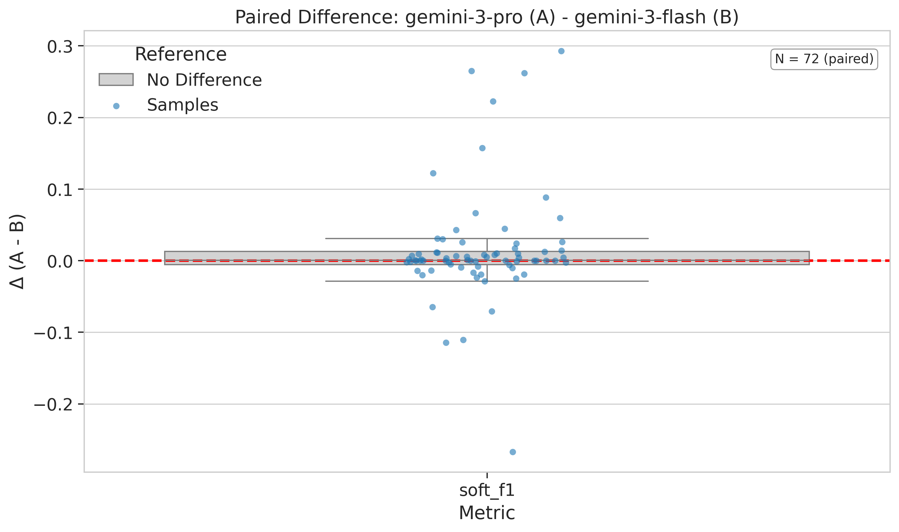
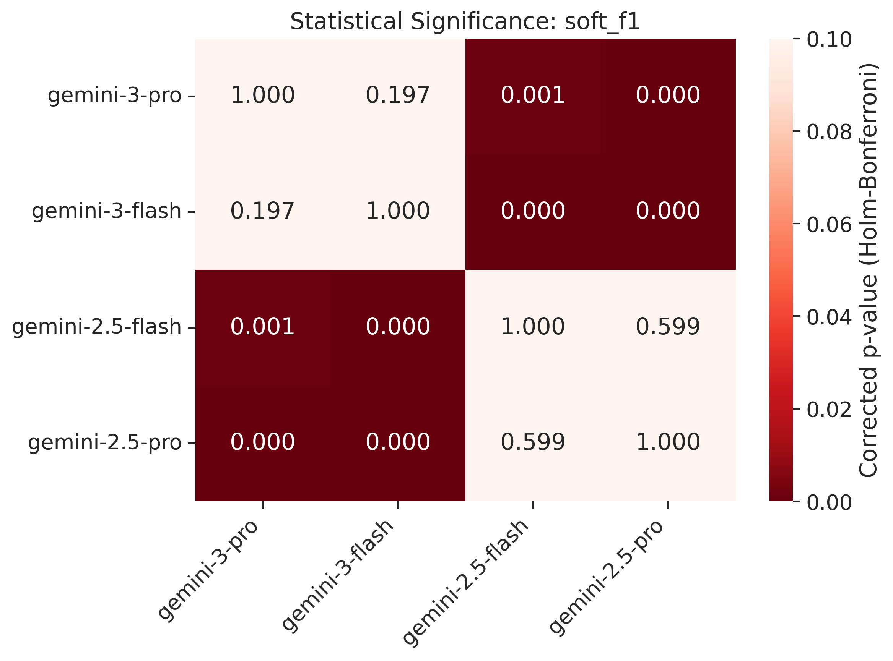

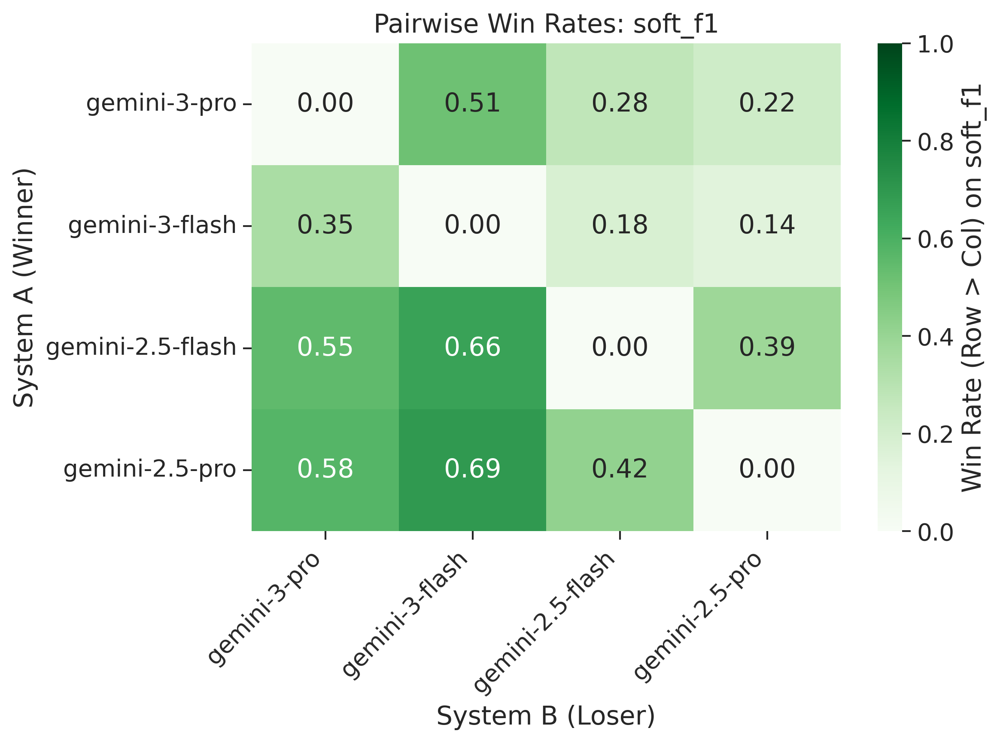

### Visualization Interpretation

This subsection provides a detailed analysis of model performance on the `soft_f1` metric, drawing from a suite of visualizations including domain breakdowns, bootstrap confidence intervals, statistical significance tests, and score distributions.

#### 1. PhD-Level Interpretation of Trends

The visualizations collectively present a clear and statistically robust narrative regarding the comparative performance of the four models. The central finding is a significant performance gap between the Gemini 2.5 generation and the Gemini 3 generation on this task, as measured by `soft_f1`. The Bootstrap Confidence Intervals (Chart 2) and the Statistical Significance heatmap (Chart 4) provide compelling evidence for this hierarchy. Both `gemini-2.5-pro` and `gemini-2.5-flash` occupy a higher performance tier, and their superiority over `gemini-3-pro` and `gemini-3-flash` is statistically significant (p < 0.001). Conversely, the differences *within* each generation (`2.5-pro` vs. `2.5-flash` and `3-pro` vs. `3-flash`) are not statistically significant (p=0.599 and p=0.197, respectively), suggesting comparable capabilities on this metric.

The distribution plots (Chart 5) reveal a critical characteristic of the task itself: it is exceptionally challenging for all models. The distributions are heavily right-skewed, with a large mass of scores concentrated near zero. This indicates that on a significant portion of the test instances, all models fail to produce outputs that are semantically close to the ground truth. While the Gemini 2.5 models have a slightly thicker tail in the higher-score region, the overall low performance underscores a fundamental difficulty in the task.

The pairwise win-rate analysis (Chart 6) corroborates these findings, showing that `gemini-2.5-pro` and `gemini-2.5-flash` win against their Gemini 3 counterparts in the majority of head-to-head comparisons (e.g., `gemini-2.5-pro` outperforms `gemini-3-flash` 69% of the time). The near 50% win rate between models of the same generation (e.g., `gemini-3-pro` wins 51% vs. `gemini-3-flash`) reinforces the lack of a significant performance delta between them, as further detailed in the Paired Difference plot (Chart 3).

#### 2. Key Takeaways

*   **Generational Superiority:** The Gemini 2.5 series (`pro` and `flash`) demonstrates a statistically significant and substantial performance advantage over the Gemini 3 series on the `soft_f1` metric.
*   **High Domain Sensitivity:** Model performance is not uniform across different domains. The `Survey_Reports` domain is a notable outlier where all models achieve their highest scores, suggesting the task is either easier or the models are better tuned for this specific document structure. Conversely, performance on `Industry_Reports` is exceptionally poor across the board.
*   **Task Difficulty:** The overall low scores, with distributions heavily skewed towards zero, indicate that the task is inherently difficult. Models frequently fail to generate semantically compliant outputs.
*   **Intra-Generation Parity:** Within the 2.5 and 3 series, the `pro` and `flash` variants exhibit statistically indistinguishable performance on this metric, suggesting that the optimizations in the `flash` models do not compromise their semantic generation capabilities in this context.

#### 3. Contrast Between Global and Domain-Specific Views

Contrasting the global confidence intervals (Chart 2) with the domain-specific breakdown (Chart 1) reveals crucial nuance that would be missed by observing the aggregate metric alone. The CI plot establishes a clear global ranking: `gemini-2.5-pro` > `gemini-2.5-flash` > `gemini-3-pro` > `gemini-3-flash`.

However, the domain breakdown heatmap complicates this simple hierarchy. It shows that this global average is driven by performance across multiple domains but can be defied in specific contexts. For example, in the `Survey_Reports` domain, both `gemini-3-flash` (0.61) and `gemini-2.5-pro` (0.62) are clear top performers, with `gemini-3-flash` substantially outperforming the globally superior `gemini-2.5-flash` (0.42). This highlights a specific strength for `gemini-3-flash` that is entirely masked in the aggregate view. Furthermore, the heatmap exposes domains like `Industry_Reports` and `Legal` where all models perform near-zero, identifying these as particularly challenging areas that drag down the global average. This analysis demonstrates that while global metrics are useful for a summary judgment, a domain-level analysis is essential to understand model-specific strengths and systemic weaknesses.

#### 4. Interpretation of `soft_f1` and Semantic Capability

The `soft_f1` metric, akin to `bert_score_f1`, is a measure of **semantic fidelity**, not rigid lexical or structural correctness. It uses contextual embeddings to evaluate the overlap in meaning between the generated text and the reference text, allowing for paraphrasing and lexical variation. A high `soft_f1` score indicates that the model has successfully captured the core meaning and key information of the target, even if the phrasing differs.

This is in stark contrast to strict correctness metrics like Exact Match or token-based F1, which penalize any deviation in wording or format. The consistently low `soft_f1` scores across all models are therefore particularly concerning. This is not merely a failure to adhere to a rigid output format; it represents a more fundamental failure to generate semantically relevant and accurate content. The models are not just "saying it wrong"; they are often failing to "say the right thing" at all. The poor performance on `soft_f1` suggests a significant gap in the models' ability to comprehend the source document and generate a semantically equivalent summary or extraction as required by the task.

---

## Analysis of Metric: `soft_recall`

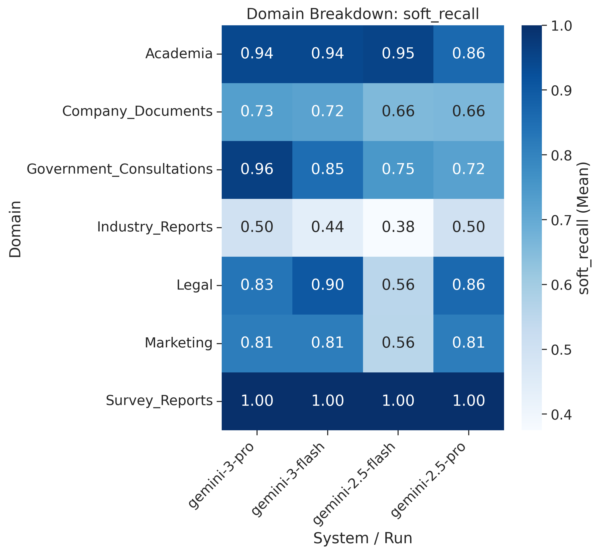
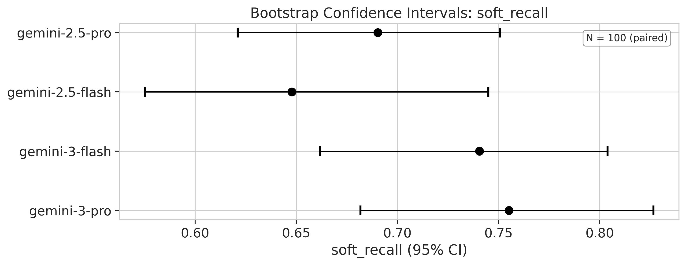

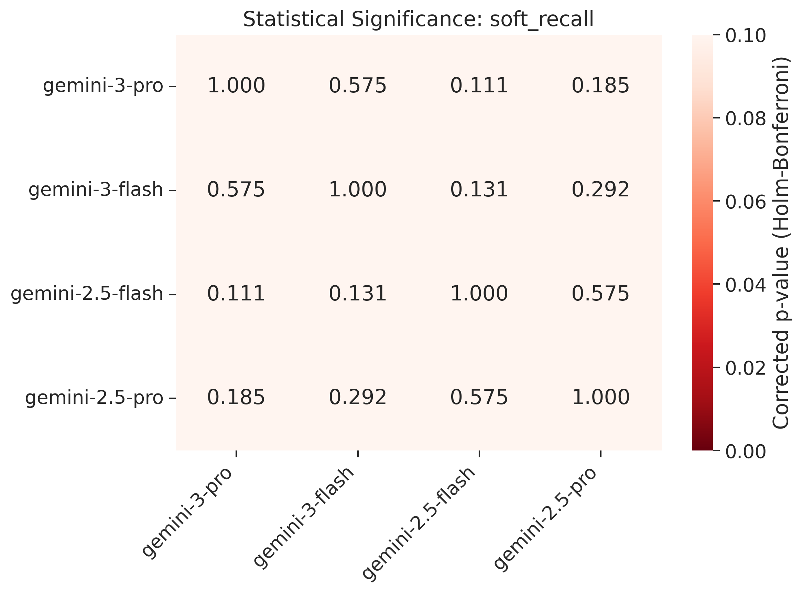
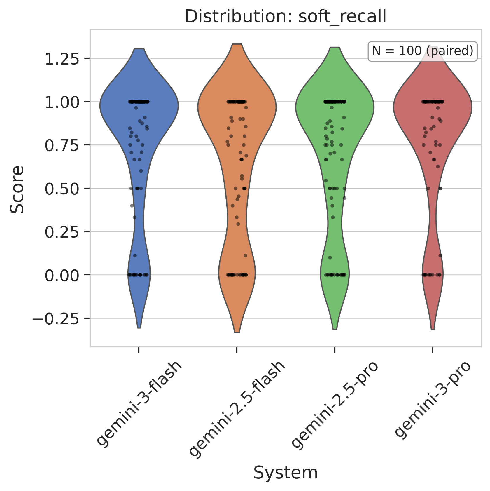
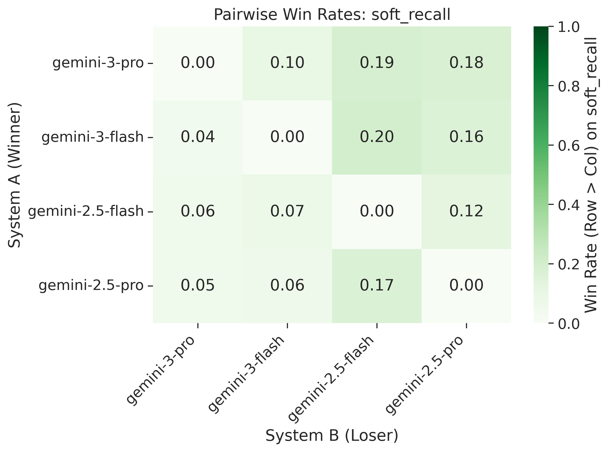

### Visualization Interpretation

This subsection provides a comprehensive analysis of the `soft_recall` metric across four Gemini models, synthesizing insights from aggregate statistical views and fine-grained domain-specific breakdowns. The `soft_recall` metric evaluates the semantic completeness of a model's generation, measuring the proportion of ground-truth concepts that are semantically captured in the output, irrespective of exact phrasing. This serves as a proxy for the model's ability to retain and reproduce all pertinent information from a source.

**1. Aggregate Performance is Statistically Inconclusive Despite Apparent Ranking**

At a global level, the Bootstrap Confidence Intervals plot suggests a performance ranking: `gemini-3-pro` (mean ≈ 0.75), `gemini-3-flash` (mean ≈ 0.74), `gemini-2.5-pro` (mean ≈ 0.69), and `gemini-2.5-flash` (mean ≈ 0.65). However, the 95% confidence intervals are wide and exhibit substantial overlap between all models. This visual observation is quantitatively confirmed by the Statistical Significance heatmap, which shows that all Holm-Bonferroni corrected p-values for pairwise comparisons are well above the conventional α=0.05 threshold (the lowest being p=0.111 between `gemini-3-pro` and `gemini-2.5-flash`). Consequently, despite the differences in mean scores, we cannot conclude with statistical confidence that any single model is superior to another based on aggregate performance. The high variance in scores across the test set obscures any potential systematic differences.

**2. Domain Sensitivity is the Primary Driver of Performance Variance**

The lack of statistical significance in the aggregate view is explained by extreme performance heterogeneity across different topical domains, as revealed in the Domain Breakdown heatmap. This chart is the most informative of the set, highlighting several key dynamics:

*   **Task-Difficulty Effect:** Performance is highly sensitive to the domain. For instance, `Survey_Reports` appears to be a trivial domain, with all models achieving a perfect `soft_recall` of 1.00. Conversely, `Industry_Reports` is exceptionally challenging, with all models struggling significantly (scores ranging from 0.38 to 0.50).
*   **Model-Domain Interaction:** The performance gap between models is not uniform. While the Gemini-3 series generally outperforms the Gemini-2.5 series, the magnitude of this advantage varies. In `Government_Consultations`, `gemini-3-pro` (0.96) is substantially better than `gemini-2.5-flash` (0.75), whereas in `Industry_Reports`, their performance is identical (0.50).
*   **Source of Variance:** The Distribution violin plots vividly illustrate this variance. The distributions are not normal but are strongly multi-modal, with large concentrations of scores at 1.00 (perfect recall, likely from easy domains like `Survey_Reports`) and 0.00 (complete failure). This confirms that the mean score is a poor summary statistic for model performance on this task; models tend to perform either very well or very poorly depending on the specific domain, rather than consistently achieving a moderate score.

**3. Pairwise Analysis Reveals High Similarity Between Top Models**

Contrasting the two highest-performing models, `gemini-3-pro` and `gemini-3-flash`, reveals a nuanced relationship. While `gemini-3-pro` has a slightly higher mean score, the Paired Difference plot shows that for the vast majority of individual test cases, their performance is identical (Δ = 0). The Pairwise Win Rates heatmap quantifies this: `gemini-3-pro` scores higher than `gemini-3-flash` on only 10% of examples, while `gemini-3-flash` wins on 4%. This implies that the models perform identically approximately 86% of the time. The perceived advantage of `gemini-3-pro` stems from a small number of instances where it significantly outperforms its counterpart, rather than a consistent, marginal improvement.

**Key Takeaways:**

*   **No Clear Overall Winner:** On aggregate, there is no statistically significant difference in `soft_recall` among the evaluated models. The apparent ranking based on mean scores is misleading due to high performance variance.
*   **Performance is Context-Dependent:** Model effectiveness in recalling information is critically dependent on the topical domain. Performance on a simple, structured domain like `Survey_Reports` is not indicative of performance on a complex one like `Industry_Reports`.
*   **Semantic Capabilities Vary:** As `soft_recall` measures semantic fidelity, the results indicate that all models struggle to capture the complete semantic content of documents in certain complex domains. This highlights a key area for improvement, moving beyond syntactic correctness to ensure comprehensive information extraction and generation.
*   **Near-Identical Performance of Top Models:** For most practical purposes, `gemini-3-pro` and `gemini-3-flash` exhibit identical capability in information recall, with differences emerging only in a small minority of cases.

---

## Analysis of Metric: `verbosity`

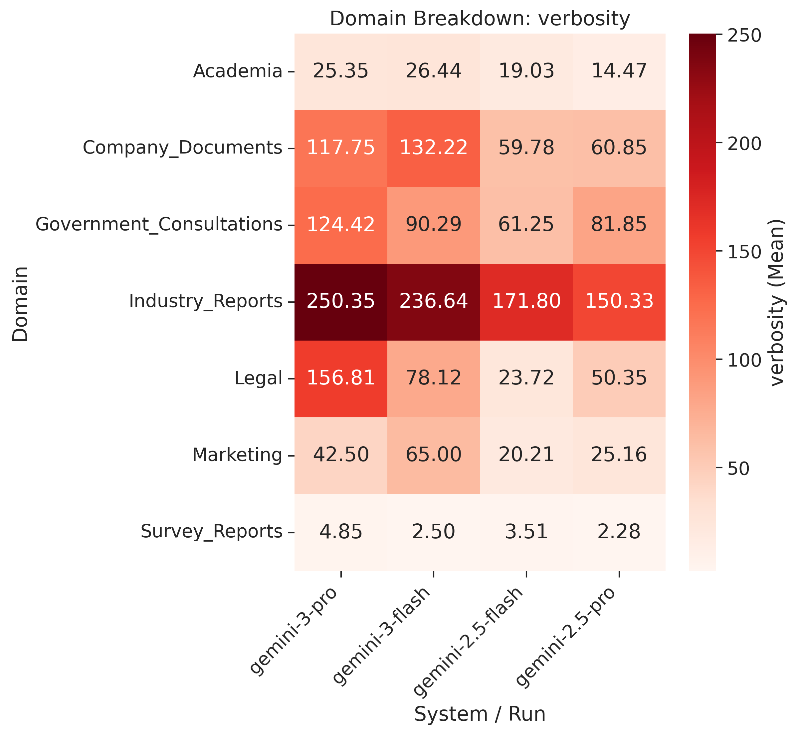
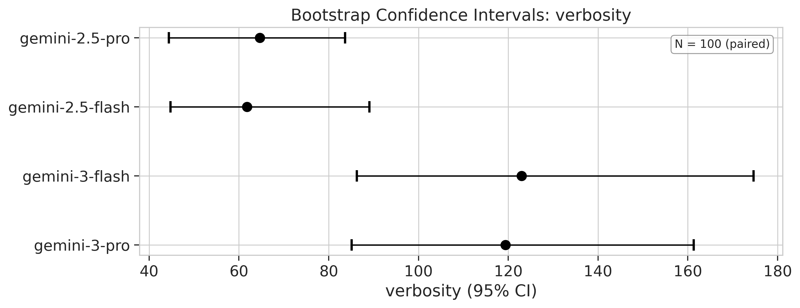
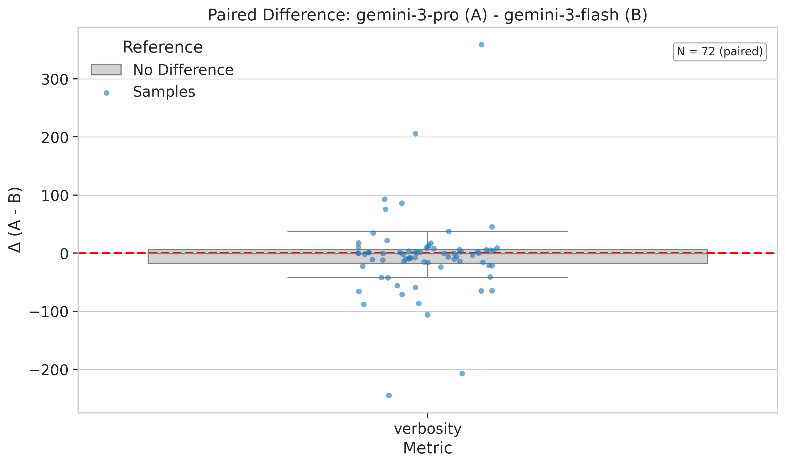

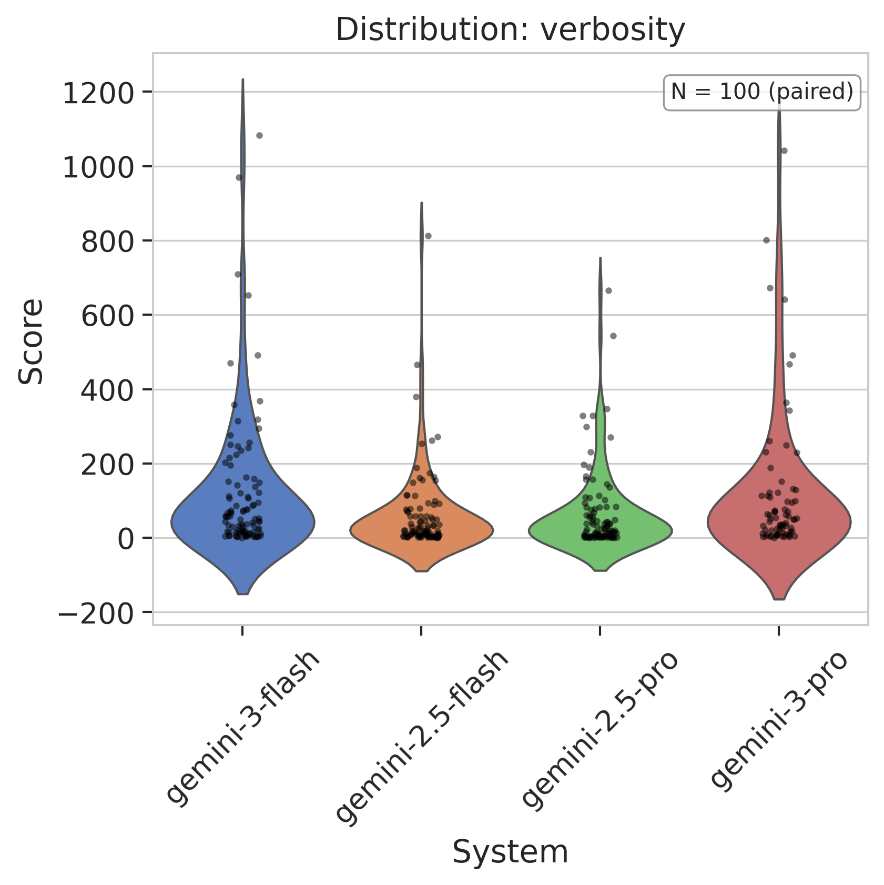

### Visualization Interpretation

This suite of visualizations provides a comprehensive analysis of model `verbosity`, measured as output length. The central finding is a clear, statistically significant generational shift: the Gemini-3 series models (`gemini-3-pro`, `gemini-3-flash`) are substantially more verbose than their Gemini-2.5 predecessors.

**1. Global Performance and Statistical Significance:**

The Bootstrap Confidence Intervals (CI) plot illustrates this primary trend at a global level. The 95% CIs for `gemini-3-pro` and `gemini-3-flash` are clustered in a higher range (approx. 85-165), while the CIs for the Gemini-2.5 models are in a distinctly lower range (approx. 45-85). The non-overlapping CIs between these two groups strongly suggest a significant difference in mean verbosity. This observation is rigorously confirmed by the Statistical Significance heatmap, which reports corrected p-values of 0.000 for all pairwise comparisons between a Gemini-3 and a Gemini-2.5 model, indicating a highly significant difference.

Conversely, within each generation, the models exhibit similar average verbosity. The CIs for `gemini-3-pro` and `gemini-3-flash` overlap, and their pairwise comparison yields a p-value of 0.191, indicating no statistically significant difference in their global means. A similar conclusion holds for `gemini-2.5-pro` and `gemini-2.5-flash` (p=0.720). The Paired Difference plot for `gemini-3-pro` vs. `gemini-3-flash` further supports this, showing a distribution of differences centered close to zero, albeit with considerable variance.

**2. Domain-Specific Sensitivity and Nuance:**

While global metrics establish a clear generational trend, the "Domain Breakdown" heatmap reveals that verbosity is highly sensitive to the topical domain. This domain-specific view provides critical context that global averages obscure:

*   **Extreme Variance Across Domains:** Model outputs for `Industry_Reports` are exceptionally verbose (mean verbosity ranging from 150 to 250), whereas for `Survey_Reports`, they are extremely concise (mean verbosity < 5). This suggests models are adapting their output length based on strong signals in the input, likely reflecting the perceived complexity or expected format of the task.
*   **Inconsistent Relative Performance:** The global similarity between `gemini-3-pro` and `gemini-3-flash` breaks down at the domain level. For example, `gemini-3-pro` is significantly more verbose in the `Legal` domain (156.81 vs. 78.12), whereas `gemini-3-flash` is more verbose in `Company_Documents` (132.22 vs. 117.75) and `Marketing` (65.00 vs. 42.50). This interaction effect between model and domain underscores the importance of fine-grained evaluation, as a model's verbosity profile is not uniform.

**3. Distribution and Key Takeaways:**

The violin plot reinforces these findings by visualizing the entire distribution of scores. All models exhibit a right-skewed distribution, with a high concentration of outputs at lower verbosity levels and a long tail of high-verbosity outliers. This pattern is far more pronounced for the Gemini-3 models, which are capable of generating extremely long responses (some exceeding 1000 words/tokens) that are absent in the Gemini-2.5 generations.

**Key Takeaways:**

*   **Generational Verbosity Increase:** The primary conclusion is that Gemini-3 models are significantly more verbose than Gemini-2.5 models.
*   **Domain as a Key Driver:** Verbosity is not an intrinsic, static property of a model but is heavily modulated by the input domain. Relying on global averages alone would be misleading.
*   **Interpretation of Verbosity:** As a metric, verbosity measures only the *length* of the output, not its quality. The observed increase in verbosity for Gemini-3 models could represent either more comprehensive, detailed responses (a positive trait) or a tendency towards unnecessary elaboration (a negative trait). To make a qualitative judgment, this analysis must be contextualized with correctness, relevance, and semantic quality metrics (e.g., `bert_score_f1`). For tasks like summarization, increased verbosity might be undesirable, whereas for tasks requiring detailed explanation, it could be beneficial.

---

## Analysis of Metric: `Behavioral Profile`

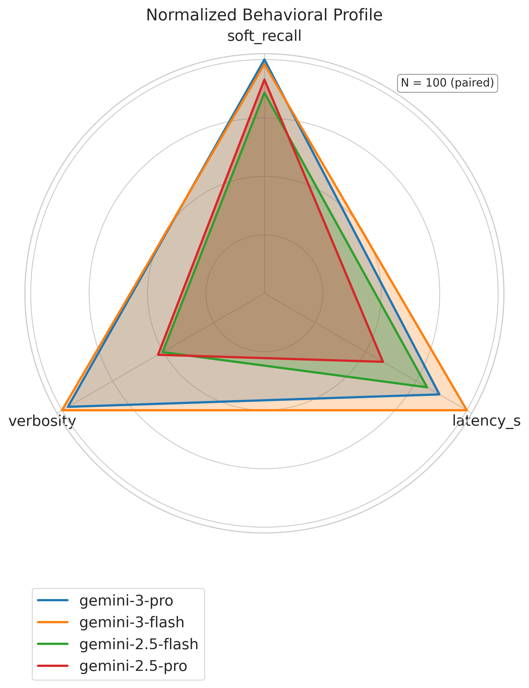

### Visualization Interpretation

This section provides a detailed analysis of the normalized behavioral profile for four models from the Gemini family: `gemini-3-pro`, `gemini-3-flash`, `gemini-2.5-flash`, and `gemini-2.5-pro`. The evaluation, conducted on a paired set of 100 instances, is visualized on a radar chart, profiling model performance across three key axes: `soft_recall` (semantic completeness), `verbosity` (output length), and `latency_s` (generation speed).

#### PhD-Level Interpretation of Trends

The visualization offers a compelling multi-dimensional comparison, revealing clear generational advancements and nuanced trade-offs between model variants.

1.  **Generational Leap in Semantic Capability:** The most prominent trend is the significant performance gap on the `soft_recall` axis between the Gemini 3 and Gemini 2.5 series. Both `gemini-3-pro` and `gemini-3-flash` achieve near-maximal scores, indicating a substantial improvement in their ability to capture and reproduce the semantic essence of the target information. `Soft_recall`, as opposed to a strict lexical metric, measures the informational completeness of the generation. This suggests the newer models possess a more robust internal representation of knowledge and a greater capacity for faithful information retrieval, a critical capability for knowledge-intensive tasks.

2.  **The Performance-Efficiency Frontier:** The chart effectively illustrates the classic trade-off between model capability and computational efficiency (latency). As expected, the "Flash" variants in both generations exhibit superior performance on the `latency_s` axis (where a higher score corresponds to lower latency), confirming their optimization for speed. Conversely, the "Pro" models are comparatively slower.

3.  **Anomalous Trade-off in the Gemini 3 Series:** A particularly insightful finding is the behavior of `gemini-3-flash`. In the Gemini 2.5 series, the expected trade-off is visible: `gemini-2.5-pro` has slightly higher `soft_recall` than `gemini-2.5-flash`, justifying its slower speed with a marginal quality improvement. However, in the Gemini 3 series, this trade-off appears to be broken. `gemini-3-flash` achieves the same elite-level `soft_recall` as its "Pro" counterpart while being significantly faster. This suggests that for this specific task and metric, the efficiency gains in the Flash model have been achieved without a discernible sacrifice in semantic completeness.

4.  **Behavioral Consistency in Verbosity:** All four models demonstrate a tendency towards high verbosity, with their scores clustered towards the outer edge of the `verbosity` axis. Interestingly, `gemini-3-flash`, the fastest model, is also the most verbose. This indicates that its speed is not achieved by merely truncating output but through architectural or inferential efficiencies. This high verbosity could be either a feature (thoroughness) or a bug (lack of conciseness), depending on the downstream application.

#### Key Takeaways

*   **Dominance of Gemini 3:** There is a clear and substantial improvement in semantic recall from the 2.5 to the 3.0 generation, positioning the newer models as far more capable for tasks requiring high informational fidelity.
*   **`gemini-3-flash` as a Standout Performer:** `gemini-3-flash` presents the most compelling overall profile. It delivers the same state-of-the-art semantic recall as `gemini-3-pro` but with significantly lower latency, making it a highly efficient and effective choice for this task. The area covered by its orange triangle is visibly the largest, indicating the best-balanced performance across the three metrics.
*   **Latency as a Key Differentiator:** The primary distinction between the "Pro" and "Flash" models lies in their latency profiles. Users must weigh the need for raw speed against other, more subtle behavioral differences that may not be captured by `soft_recall` alone.
*   **High Verbosity is a Cross-Model Trait:** The models evaluated are characteristically verbose, a behavioral aspect that should be considered during prompting or in post-processing for applications requiring conciseness.

#### Contrasting Views and Limitations

The provided chart presents a **global behavioral profile**, averaging performance across the entire N=100 test set. This high-level view is excellent for identifying macro-trends, such as the generational leap and the efficiency of `gemini-3-flash`.

However, this aggregation may mask critical domain-specific sensitivities. The observed superiority in `soft_recall` for the Gemini 3 models might be heavily concentrated in certain topical domains (e.g., technical question-answering) while performance could be more comparable in others (e.g., creative summarization). The consistency of these behavioral profiles across diverse domains remains an open question. A more granular analysis, featuring domain-specific breakdowns of this radar chart, would be essential to assess the robustness of these findings and identify specific areas of strength or weakness for each model. Without such a breakdown, we cannot conclude that the observed performance is consistent across all types of tasks.

---

